# Manual Técnico - Fashionista e-Boutique

---
Título: "Manual Técnico — <Fashionista e-Boutique>"
Versión: "v1.0"
Fecha: "2025-11-09"
Empresa: "Fashionista e-Boutique"
Proyecto: "Manual Técnico"
Formato: "Markdown"
---


**Fashionista e-Boutique** es una aplicación web de comercio electrónico full-stack moderna y escalable. La plataforma está construida con una arquitectura robusta que separa el frontend (React + Material-UI) del backend (Node.js + Express + MongoDB), ofreciendo una experiencia de usuario excepcional con funcionalidades completas de catálogo de productos, carrito de compras, autenticación segura, gestión de pedidos, sistema de reviews y panel de administración.


# 1.  Objetivo

El objetivo de este manual es documentar la arquitectura, componentes, configuraciones, dependencias y procedimientos técnicos necesarios para la instalación, operación, mantenimiento y actualización del sistema Fashionista e-Boutique.
Este documento sirve como referencia para desarrolladores, administradores de sistema y personal técnico encargado del soporte y evolución de la plataforma, garantizando la correcta comprensión y continuidad del proyecto a lo largo de su ciclo de vida.

## 2. Prerrequisitos de Instalación

- ✅ Node.js (v16 o superior)
- ✅ MongoDB (local o Atlas)
- ✅ npm o yarn
- ✅ Git

## 3. Frameworks y Estándares Utilizados

### **Frontend**

- **React 18**: Biblioteca de JavaScript para interfaces de usuario
- **Material-UI (MUI) 5**: Framework de componentes React con Material Design
- **React Router 6**: Navegación y routing del lado del cliente
- **Context API**: Gestión de estado global optimizada
- **Axios**: Cliente HTTP para comunicación con APIs
- **React Hooks**: useState, useEffect, useContext, useCallback, useMemo

### **Backend**

- **Node.js 16+**: Entorno de ejecución de JavaScript del lado del servidor
- **Express.js 4**: Framework web minimalista y flexible
- **MongoDB 5**: Base de datos NoSQL orientada a documentos
- **Mongoose 6**: ODM (Object Document Mapper) para MongoDB
- **JWT (jsonwebtoken)**: Autenticación basada en tokens
- **bcryptjs**: Encriptación de contraseñas
- **cors**: Middleware para Cross-Origin Resource Sharing
- **dotenv**: Gestión de variables de entorno


## 4. Diagrama de Casos de Uso del Sistema


## 5. Modelo Entidad-Relación de la Base de Datos



## 6. Diccionario de Datos

**Colección Usuarios:**


| Campo             |     Tipo | Requerido | Descripción                                  |
| ----------------- | -------: | :-------: | -------------------------------------------- |
| `_id`             | ObjectId |     Sí    | Identificador único del usuario.             |
| `name`            |   String |     Sí    | Nombre completo del usuario.                 |
| `email`           |   String | Sí, único | Correo electrónico usado para autenticación. |
| `password`        |   String |     Sí    | Contraseña cifrada.                          |
| `role`            |   String |     Sí    | Rol del usuario (`admin` o `customer`).      |
| `avatar`          |   String |     No    | Imagen o avatar del usuario.                 |
| `phone`           |   String |     No    | Número de teléfono.                          |
| `address`         |   Object |     No    | Dirección completa del usuario.              |
| `address.street`  |   String |     No    | Calle y número.                              |
| `address.city`    |   String |     No    | Ciudad.                                      |
| `address.state`   |   String |     No    | Departamento / Estado.                       |
| `address.zipCode` |   String |     No    | Código postal.                               |
| `address.country` |   String |     No    | País.                                        |
| `isActive`        |  Boolean |     Sí    | Estado del usuario (activo/inactivo).        |
| `lastLogin`       |     Date |     No    | Última fecha de acceso.                      |
| `createdAt`       |     Date |     Sí    | Fecha de creación del registro.              |
| `updatedAt`       |     Date |     No    | Fecha de última actualización.               |
| `__v`             |   Number |     No    | Control de versión del documento (Mongoose). |

**Colección Productos:**

| Campo              |          Tipo | Requerido | Descripción                                       |
| ------------------ | ------------: | :-------: | ------------------------------------------------- |
| `_id`              |      ObjectId |     Sí    | Identificador único del producto.                 |
| `name`             |        String |     Sí    | Nombre del producto.                              |
| `description`      |        String |     No    | Descripción del producto.                         |
| `price`            |        Number |     Sí    | Precio de venta.                                  |
| `discount`         |        Number |     No    | Descuento aplicado.                               |
| `category`         |        String |     Sí    | Categoría del producto.                           |
| `images`           | Array |             No    | Lista de imágenes asociadas al producto.          |
| `images.url`       |        String |     Sí    | URL de la imagen.                                 |
| `images.alt`       |        String |     No    | Descripción alternativa de la imagen.             |
| `images.isPrimary` |       Boolean |     No    | Indica si es la imagen principal.                 |
| `stock`            |        Number |     Sí    | Cantidad disponible en inventario.                |
| `tags`             | Array         |     No    | Etiquetas adicionales para búsqueda.              |
| `rating`           |        Object |     No    | Información de valoración del producto.           |
| `rating.average`   |        Number |     No    | Valoración promedio.                              |
| `rating.count`     |        Number |     No    | Número de valoraciones registradas.               |
| `isActive`         |       Boolean |     Sí    | Indica si el producto está habilitado para venta. |
| `isFeatured`       |       Boolean |     No    | Indica si se muestra como destacado.              |
| `salesCount`       |        Number |     No    | Total de unidades vendidas.                       |
| `features`         | Array         |     No    | Características adicionales del producto.         |
| `reviews`          | Array         |     No    | Lista de reseñas de usuarios.                     |
| `reviews.user`     |      ObjectId |     No    | Referencia al usuario que deja la reseña.         |
| `reviews.rating`   |        Number |     No    | Puntuación dada por el usuario.                   |
| `reviews.comment`  |        String |     No    | Comentario de la reseña.                          |
| `reviews.date`     |          Date |     No    | Fecha de la reseña.                               |
| `createdAt`        |          Date |     Sí    | Fecha de creación del registro.                   |
| `updatedAt`        |          Date |     No    | Fecha de última actualización.                    |
| `__v`              |        Number |     No    | Control de versión del documento.                 |


**Colección Órdenes:**

| Campo         |                 Tipo | Requerido | Descripción                                        |
| ------------- | -------------------: | :-------: | -------------------------------------------------- |
| `_id`         |             ObjectId |     Sí    | Identificador único de la orden.                   |
| `user`        | ObjectId (ref: User) |     Sí    | Referencia al usuario que realiza la compra.       |
| `orderNumber` |               String | Sí, único | Número único de la orden generado automáticamente. |
| `items`       |        Array         |     Sí    | Lista de productos incluidos en la orden.          |

**Subdocumento Ítems:**

| Campo            |                    Tipo | Requerido | Descripción                                  |
| ---------------- | ----------------------: | :-------: | -------------------------------------------- |
| `items.product`  | ObjectId (ref: Product) |     Sí    | Identificador del producto comprado.         |
| `items.name`     |                  String |     Sí    | Nombre del producto en el momento de compra. |
| `items.price`    |                  Number |     Sí    | Precio unitario aplicado.                    |
| `items.quantity` |                  Number |     Sí    | Cantidad del producto comprada.              |
| `items.image`    |                  String |     No    | Imagen asociada al producto.                 |


## 7. Scripts de Instalación


1. **📥 Clonar el repositorio**:

   ```bash
   git clone <repository-url>
   cd REQURIMIENTOS_ELBA
   ```

2. **🗄️ Configurar MongoDB**:

   **Opción A: MongoDB Local (Recomendado para desarrollo)**

   ```bash
   # Windows - Instalar MongoDB
   # Descargar desde: https://www.mongodb.com/try/download/community

   # Iniciar servicio MongoDB
   net start MongoDB
   ```

   **Opción B: MongoDB Atlas (Producción)**

   - Crear cuenta gratuita en [MongoDB Atlas](https://www.mongodb.com/cloud/atlas)
   - Crear cluster gratuito (512MB)
   - Obtener string de conexión
   - Configurar IP whitelist (0.0.0.0/0 para desarrollo)

3. **⚙️ Configurar Backend**:

   ```bash
   cd backend
   npm install

   # El archivo .env ya está configurado con:
   # MONGODB_URI=mongodb://localhost:27017/fashionista
   # JWT_SECRET=tu_jwt_secret_muy_seguro_aqui_cambiar_en_produccion
   # PORT=5000
   # FRONTEND_URL=http://localhost:3000

   # Poblar base de datos con productos de ejemplo
   node scripts/seedProducts.js

   # Iniciar servidor backend
   npm run dev
   ```

4. **🎨 Configurar Frontend**:

   ```bash
   # Abrir nueva terminal
   cd frontend
   npm install

   # El archivo .env ya está configurado con:
   # REACT_APP_API_URL=http://localhost:5000/api

   # Iniciar aplicación React
   npm start
   ```

5. **🌐 Acceder a la aplicación**:
   - **Frontend**: http://localhost:3000
   - **Backend API**: http://localhost:5000/api
   - **Productos**: http://localhost:5000/api/products

## 8. Plan de despliegue

### Desarrollo
- Backend ejecutado en `http://localhost:5000`
- Frontend ejecutado en `http://localhost:3000`

### Producción
- Frontend desplegado en Netlify
- Backend desplegado en Render / Railway / Heroku
- Base de datos en MongoDB Atlas


## 9. Arquitectura del sistema (Diagrama de Componentes)


## 10. Seguridad del Sistema

- **Autenticación JWT**: Tokens seguros con expiración
- **Encriptación de contraseñas**: bcrypt con salt rounds
- **Validación de datos**: Sanitización en frontend y backend
- **CORS configurado**: Control de acceso entre dominios
- **Rutas protegidas**: Middleware de autenticación
- **Variables de entorno**: Configuración segura de credenciales

## 11. Respaldo y Recuperación de Datos

- Base de datos almacenada en MongoDB Atlas / Local
- Respaldo completo semanal
- Respaldo incremental diario
- Exportación automática con `mongodump`
- Verificación de integridad con `mongorestore --dry-run`

## 12. Estrategia de Pruebas

### Tipos de pruebas:
- Pruebas unitarias
- Pruebas de integración 
- Pruebas funcionales del flujo
- Pruebas de interfaz manuales 