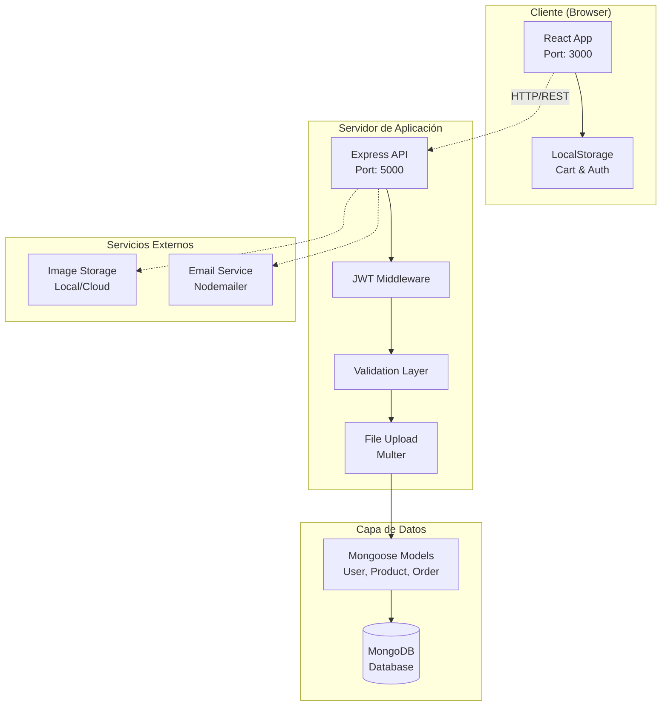
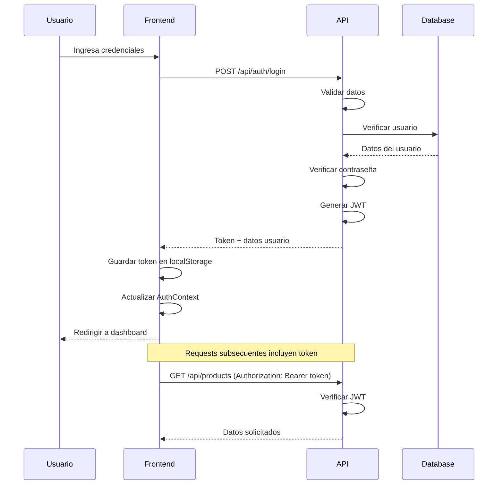
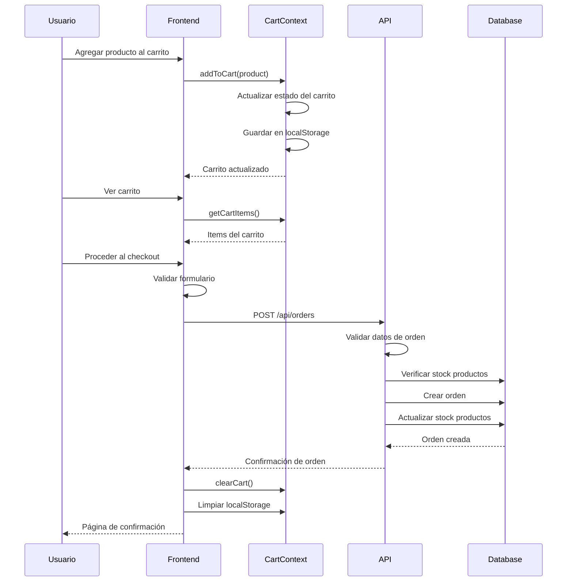
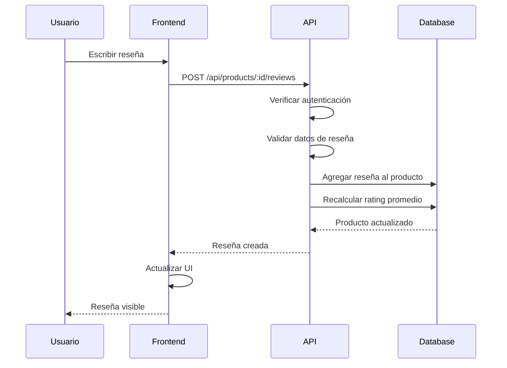
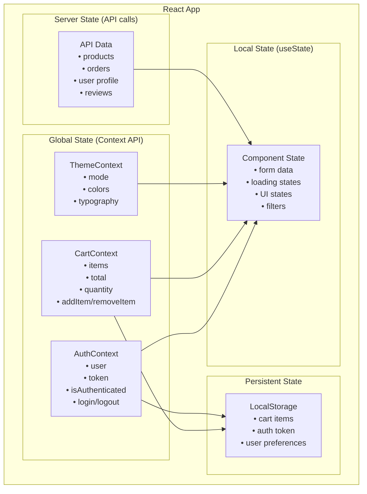
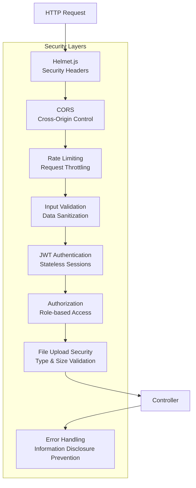
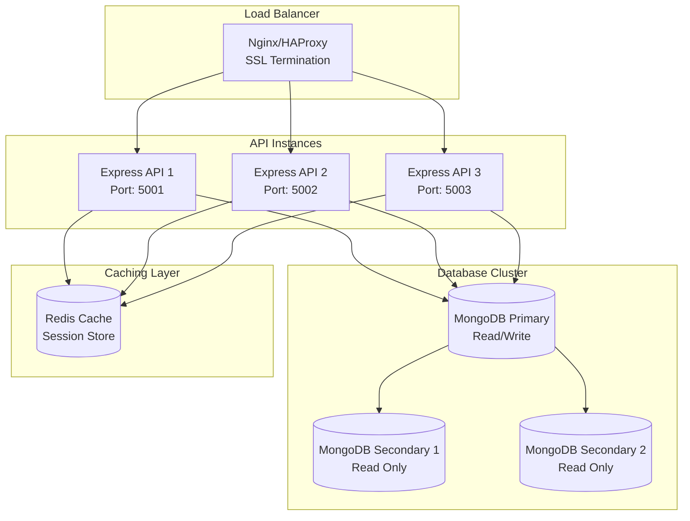
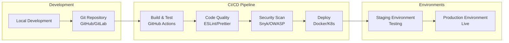

# 🏗️ Arquitectura del Sistema - Fashionista e-Boutique

## 🎯 Visión General

Fashionista e-Boutique implementa una **arquitectura moderna de aplicación web full-stack** con separación completa entre frontend y backend, diseñada para escalabilidad, mantenibilidad y rendimiento óptimo. La aplicación sigue los principios de **Clean Architecture** y **Domain-Driven Design**.

### 🚀 Características Arquitectónicas

- **Separación de Responsabilidades**: Frontend y backend completamente desacoplados
- **API RESTful**: Comunicación estándar mediante HTTP/JSON
- **Autenticación Stateless**: JWT para sesiones distribuidas
- **Base de Datos NoSQL**: MongoDB para flexibilidad y escalabilidad
- **Responsive Design**: Interfaz adaptable a todos los dispositivos
- **Modularidad**: Componentes y servicios reutilizables
- **Sistema de Reseñas**: Funcionalidad completa de calificaciones
- **Carrito Persistente**: Estado del carrito mantenido en localStorage
- **Checkout Completo**: Proceso de compra end-to-end

---

## 🛠️ Stack Tecnológico

### 🔧 Backend (API Server)
| Tecnología | Versión | Propósito |
|------------|---------|-----------|
| **Node.js** | v18+ | Runtime de JavaScript del servidor |
| **Express.js** | v4.18+ | Framework web minimalista y flexible |
| **MongoDB** | v7.0+ | Base de datos NoSQL orientada a documentos |
| **Mongoose** | v8.0+ | ODM elegante para MongoDB |
| **JWT** | v9.0+ | Autenticación basada en tokens |
| **bcryptjs** | v2.4+ | Hashing seguro de contraseñas |
| **cors** | v2.8+ | Manejo de Cross-Origin Resource Sharing |
| **dotenv** | v16.0+ | Gestión de variables de entorno |
| **express-validator** | v7.0+ | Validación de datos de entrada |
| **helmet** | v7.0+ | Seguridad HTTP headers |
| **multer** | v1.4+ | Manejo de archivos multipart |

### 🎨 Frontend (React App)
| Tecnología | Versión | Propósito |
|------------|---------|-----------|
| **React** | v18.2+ | Biblioteca para interfaces de usuario |
| **Material-UI (MUI)** | v5.14+ | Sistema de diseño y componentes UI |
| **React Router DOM** | v6.15+ | Enrutamiento declarativo |
| **Axios** | v1.5+ | Cliente HTTP para llamadas a la API |
| **React Hook Form** | v7.45+ | Gestión eficiente de formularios |
| **jwt-decode** | v3.1+ | Decodificación de tokens JWT |
| **@emotion/react** | v11.11+ | CSS-in-JS para estilos dinámicos |
| **@emotion/styled** | v11.11+ | Componentes estilizados |
| **@mui/icons-material** | v5.14+ | Iconografía Material Design |

---

## 🏛️ Arquitectura del Sistema



### 🔄 Flujo de Comunicación

```
┌─────────────────┐    HTTPS/REST     ┌─────────────────┐    Mongoose     ┌─────────────────┐
│                 │ ◄───────────────► │                 │ ◄──────────────► │                 │
│   React Client  │                   │   Express API   │                 │   MongoDB       │
│   (Port: 3000)  │                   │   (Port: 5000)  │                 │   (Database)    │
│                 │                   │                 │                 │                 │
│ • Components    │                   │ • Routes        │                 │ • Collections   │
│ • Context API   │                   │ • Controllers   │                 │ • Documents     │
│ • Services      │                   │ • Middleware    │                 │ • Indexes       │
│ • Hooks         │                   │ • Models        │                 │ • Aggregations  │
│ • Pages         │                   │ • Validation    │                 │ • Relationships │
└─────────────────┘                   └─────────────────┘                 └─────────────────┘
```

---

## 📁 Estructura de Directorios Detallada

```
REQURIMIENTOS_ELBA/
├── 📁 backend/                    # Servidor API Node.js/Express
│   ├── 📁 config/                # Configuraciones del sistema
│   │   ├── database.js           # Configuración de MongoDB
│   │   └── jwt.js               # Configuración de JWT
│   ├── 📁 controllers/          # Lógica de negocio
│   │   ├── authController.js    # Autenticación y autorización
│   │   ├── productController.js # Gestión de productos
│   │   ├── orderController.js   # Procesamiento de órdenes
│   │   └── userController.js    # Gestión de usuarios
│   ├── 📁 middleware/           # Middleware personalizado
│   │   ├── auth.js             # Verificación de JWT
│   │   ├── admin.js            # Verificación de rol admin
│   │   ├── validation.js       # Validación de datos
│   │   ├── upload.js           # Manejo de archivos
│   │   └── errorHandler.js     # Manejo centralizado de errores
│   ├── 📁 models/              # Modelos de datos (Mongoose)
│   │   ├── User.js             # Esquema de usuarios
│   │   ├── Product.js          # Esquema de productos (con reviews)
│   │   └── Order.js            # Esquema de órdenes
│   ├── 📁 routes/              # Definición de rutas API
│   │   ├── auth.js             # Rutas de autenticación
│   │   ├── products.js         # Rutas de productos y reviews
│   │   ├── orders.js           # Rutas de órdenes
│   │   └── users.js            # Rutas de usuarios
│   ├── 📁 utils/               # Utilidades del backend
│   │   ├── generateToken.js    # Generación de JWT
│   │   ├── sendEmail.js        # Envío de emails
│   │   ├── validators.js       # Validadores personalizados
│   │   └── helpers.js          # Funciones auxiliares
│   ├── 📁 scripts/             # Scripts de utilidad
│   │   ├── seedProducts.js     # Poblar productos de ejemplo
│   │   └── createAdmin.js      # Crear usuario administrador
│   ├── 📁 uploads/             # Directorio de archivos subidos
│   │   └── products/           # Imágenes de productos
│   ├── 📄 server.js            # Punto de entrada del servidor
│   ├── 📄 package.json         # Dependencias del backend
│   └── 📄 .env                 # Variables de entorno
│
├── 📁 frontend/                   # Aplicación React
│   ├── 📁 public/                # Archivos estáticos
│   │   ├── index.html           # HTML principal
│   │   ├── favicon.ico          # Icono de la aplicación
│   │   ├── manifest.json        # Configuración PWA
│   │   └── robots.txt           # Configuración SEO
│   └── 📁 src/                  # Código fuente React
│       ├── 📁 components/       # Componentes reutilizables
│       │   ├── 📁 common/       # Componentes comunes
│       │   │   ├── Header.js    # Barra de navegación
│       │   │   ├── Footer.js    # Pie de página
│       │   │   ├── Loading.js   # Indicador de carga
│       │   │   ├── ErrorBoundary.js # Manejo de errores
│       │   │   └── ProtectedRoute.js # Rutas protegidas
│       │   ├── 📁 product/      # Componentes de productos
│       │   │   ├── ProductCard.js    # Tarjeta de producto
│       │   │   ├── ProductList.js    # Lista de productos
│       │   │   ├── ProductDetail.js  # Detalle de producto
│       │   │   ├── ProductFilter.js  # Filtros de búsqueda
│       │   │   └── ProductReviews.js # Sistema de reseñas
│       │   ├── 📁 cart/         # Componentes del carrito
│       │   │   ├── CartItem.js       # Item del carrito
│       │   │   ├── CartSummary.js    # Resumen del carrito
│       │   │   ├── CartDrawer.js     # Carrito lateral
│       │   │   └── Checkout.js       # Proceso de compra
│       │   ├── 📁 auth/         # Componentes de autenticación
│       │   │   ├── LoginForm.js      # Formulario de login
│       │   │   ├── RegisterForm.js   # Formulario de registro
│       │   │   └── UserProfile.js    # Perfil de usuario
│       │   └── 📁 ui/           # Componentes UI reutilizables
│       │       ├── Button.js         # Botón personalizado
│       │       ├── Input.js          # Input personalizado
│       │       └── Modal.js          # Modal personalizado
│       ├── 📁 context/          # Context providers (Estado global)
│       │   ├── AuthContext.js   # Contexto de autenticación
│       │   ├── CartContext.js   # Contexto del carrito
│       │   └── ThemeContext.js  # Contexto del tema
│       ├── 📁 hooks/            # Custom hooks
│       │   ├── useAuth.js       # Hook de autenticación
│       │   ├── useCart.js       # Hook del carrito
│       │   ├── useApi.js        # Hook para llamadas API
│       │   ├── useLocalStorage.js # Hook para localStorage
│       │   └── useDebounce.js   # Hook para debounce
│       ├── 📁 pages/            # Páginas principales
│       │   ├── Home.js          # Página de inicio
│       │   ├── Products.js      # Catálogo de productos
│       │   ├── ProductDetail.js # Detalle de producto
│       │   ├── Cart.js          # Carrito de compras
│       │   ├── Checkout.js      # Proceso de compra
│       │   ├── Profile.js       # Perfil de usuario
│       │   ├── Orders.js        # Historial de órdenes
│       │   ├── About.js         # Acerca de nosotros
│       │   ├── Contact.js       # Contacto
│       │   ├── Login.js         # Página de login
│       │   ├── Register.js      # Página de registro
│       │   └── NotFound.js      # Página 404
│       ├── 📁 services/         # Servicios para API calls
│       │   ├── api.js           # Configuración base de Axios
│       │   ├── authService.js   # Servicios de autenticación
│       │   ├── productService.js # Servicios de productos
│       │   ├── orderService.js  # Servicios de órdenes
│       │   └── userService.js   # Servicios de usuario
│       ├── 📁 utils/            # Utilidades del frontend
│       │   ├── constants.js     # Constantes de la aplicación
│       │   ├── helpers.js       # Funciones auxiliares
│       │   ├── formatters.js    # Formateadores de datos
│       │   ├── validators.js    # Validadores de formularios
│       │   └── storage.js       # Utilidades de localStorage
│       ├── 📁 styles/           # Estilos globales
│       │   ├── theme.js         # Tema de Material-UI
│       │   ├── globals.css      # Estilos globales
│       │   └── variables.css    # Variables CSS
│       ├── 📄 App.js            # Componente principal
│       ├── 📄 index.js          # Punto de entrada React
│       └── 📄 .env              # Variables de entorno del frontend
│
├── 📁 docs/                      # Documentación del proyecto
│   ├── README.md                # Documentación principal
│   ├── api.md                   # Documentación de la API
│   ├── instalacion.md           # Guía de instalación
│   ├── arquitectura.md          # Arquitectura del sistema
│   ├── base-de-datos.md         # Documentación de la BD
│   ├── database.md              # Esquemas de base de datos
│   ├── desarrollo.md            # Guía de desarrollo
│   ├── frontend.md              # Documentación del frontend
│   ├── testing.md               # Guía de testing
│   ├── deployment.md            # Guía de despliegue
│   └── troubleshooting.md       # Solución de problemas
│
├── 📄 README.md                  # Documentación principal
├── 📄 package.json               # Configuración del workspace
└── 📄 .gitignore                # Archivos ignorados por Git
```

---

## 🔄 Flujo de Datos y Comunicación

### 🔐 Flujo de Autenticación



### 🛒 Flujo de Compra Completo



### ⭐ Flujo de Reseñas



### 📊 Gestión de Estado (Frontend)



---

## 🎨 Patrones de Diseño Implementados

### 🔧 Backend Patterns

#### 1. **MVC (Model-View-Controller)**
```javascript
// Model (Mongoose Schema)
const productSchema = new mongoose.Schema({
  name: { type: String, required: true },
  price: { type: Number, required: true },
  reviews: [{
    user: { type: mongoose.Schema.Types.ObjectId, ref: 'User' },
    rating: { type: Number, min: 1, max: 5 },
    comment: String,
    createdAt: { type: Date, default: Date.now }
  }],
  rating: {
    average: { type: Number, default: 0 },
    count: { type: Number, default: 0 }
  }
});

// Controller (Business Logic)
const getProducts = async (req, res) => {
  try {
    const { page = 1, limit = 12, category, search } = req.query;
    const filter = { isActive: true };
    
    if (category) filter.category = category;
    if (search) filter.$text = { $search: search };
    
    const products = await Product.find(filter)
      .limit(limit * 1)
      .skip((page - 1) * limit)
      .populate('reviews.user', 'name');
      
    res.json({ success: true, data: products });
  } catch (error) {
    res.status(500).json({ success: false, message: error.message });
  }
};
```

#### 2. **Middleware Pattern**
```javascript
// Authentication Middleware
const auth = (req, res, next) => {
  const token = req.header('Authorization')?.replace('Bearer ', '');
  
  if (!token) {
    return res.status(401).json({ 
      success: false, 
      message: 'Access denied. No token provided.' 
    });
  }
  
  try {
    const decoded = jwt.verify(token, process.env.JWT_SECRET);
    req.user = decoded;
    next();
  } catch (error) {
    res.status(400).json({ 
      success: false, 
      message: 'Invalid token.' 
    });
  }
};

// File Upload Middleware
const upload = multer({
  storage: multer.diskStorage({
    destination: (req, file, cb) => {
      cb(null, 'uploads/products/');
    },
    filename: (req, file, cb) => {
      const uniqueSuffix = Date.now() + '-' + Math.round(Math.random() * 1E9);
      cb(null, file.fieldname + '-' + uniqueSuffix + path.extname(file.originalname));
    }
  }),
  fileFilter: (req, file, cb) => {
    if (file.mimetype.startsWith('image/')) {
      cb(null, true);
    } else {
      cb(new Error('Only image files are allowed!'), false);
    }
  },
  limits: { fileSize: 5 * 1024 * 1024 } // 5MB limit
});
```

#### 3. **Repository Pattern**
```javascript
// Product Repository
class ProductRepository {
  async findById(id) {
    return await Product.findById(id)
      .populate('reviews.user', 'name email');
  }
  
  async findWithFilters(filters, options = {}) {
    const { page = 1, limit = 12, sort = '-createdAt' } = options;
    
    return await Product.find(filters)
      .sort(sort)
      .limit(limit * 1)
      .skip((page - 1) * limit)
      .populate('reviews.user', 'name');
  }
  
  async addReview(productId, reviewData) {
    const product = await Product.findById(productId);
    product.reviews.push(reviewData);
    
    // Recalculate average rating
    const totalRating = product.reviews.reduce((sum, review) => sum + review.rating, 0);
    product.rating.average = totalRating / product.reviews.length;
    product.rating.count = product.reviews.length;
    
    return await product.save();
  }
}
```

### 🎨 Frontend Patterns

#### 1. **Component Pattern**
```jsx
// Reusable Product Card Component
const ProductCard = ({ product, onAddToCart }) => {
  const { user } = useAuth();
  const navigate = useNavigate();
  
  const handleAddToCart = () => {
    if (!user) {
      navigate('/login');
      return;
    }
    onAddToCart(product);
  };
  
  return (
    <Card sx={{ height: '100%', display: 'flex', flexDirection: 'column' }}>
      <CardMedia
        component="img"
        height="200"
        image={product.images[0]?.url || '/placeholder.jpg'}
        alt={product.name}
      />
      <CardContent sx={{ flexGrow: 1 }}>
        <Typography variant="h6" component="h2" gutterBottom>
          {product.name}
        </Typography>
        <Typography variant="body2" color="text.secondary" paragraph>
          {product.description}
        </Typography>
        <Box display="flex" alignItems="center" mb={1}>
          <Rating value={product.rating.average} readOnly size="small" />
          <Typography variant="body2" color="text.secondary" ml={1}>
            ({product.rating.count})
          </Typography>
        </Box>
        <Typography variant="h6" color="primary">
          ${product.price}
        </Typography>
      </CardContent>
      <CardActions>
        <Button 
          fullWidth 
          variant="contained" 
          onClick={handleAddToCart}
          disabled={product.stock === 0}
        >
          {product.stock === 0 ? 'Out of Stock' : 'Add to Cart'}
        </Button>
      </CardActions>
    </Card>
  );
};
```

#### 2. **Provider Pattern (Context API)**
```jsx
// Cart Context Provider
const CartProvider = ({ children }) => {
  const [cartItems, setCartItems] = useState([]);
  const [isLoading, setIsLoading] = useState(false);
  
  // Load cart from localStorage on mount
  useEffect(() => {
    const savedCart = localStorage.getItem('cart');
    if (savedCart) {
      setCartItems(JSON.parse(savedCart));
    }
  }, []);
  
  // Save cart to localStorage whenever it changes
  useEffect(() => {
    localStorage.setItem('cart', JSON.stringify(cartItems));
  }, [cartItems]);
  
  const addToCart = (product, quantity = 1) => {
    setCartItems(prevItems => {
      const existingItem = prevItems.find(item => item._id === product._id);
      
      if (existingItem) {
        return prevItems.map(item =>
          item._id === product._id
            ? { ...item, quantity: item.quantity + quantity }
            : item
        );
      }
      
      return [...prevItems, { ...product, quantity }];
    });
  };
  
  const removeFromCart = (productId) => {
    setCartItems(prevItems => prevItems.filter(item => item._id !== productId));
  };
  
  const updateQuantity = (productId, quantity) => {
    if (quantity <= 0) {
      removeFromCart(productId);
      return;
    }
    
    setCartItems(prevItems =>
      prevItems.map(item =>
        item._id === productId ? { ...item, quantity } : item
      )
    );
  };
  
  const clearCart = () => {
    setCartItems([]);
    localStorage.removeItem('cart');
  };
  
  const getTotalPrice = () => {
    return cartItems.reduce((total, item) => total + (item.price * item.quantity), 0);
  };
  
  const getTotalItems = () => {
    return cartItems.reduce((total, item) => total + item.quantity, 0);
  };
  
  const value = {
    cartItems,
    addToCart,
    removeFromCart,
    updateQuantity,
    clearCart,
    getTotalPrice,
    getTotalItems,
    isLoading
  };
  
  return (
    <CartContext.Provider value={value}>
      {children}
    </CartContext.Provider>
  );
};
```

#### 3. **Custom Hooks Pattern**
```jsx
// Custom Hook for API calls with loading and error states
const useApi = (url, options = {}) => {
  const [data, setData] = useState(null);
  const [loading, setLoading] = useState(true);
  const [error, setError] = useState(null);
  
  const fetchData = useCallback(async () => {
    try {
      setLoading(true);
      setError(null);
      const response = await api.get(url, options);
      setData(response.data);
    } catch (err) {
      setError(err.response?.data?.message || err.message);
    } finally {
      setLoading(false);
    }
  }, [url, JSON.stringify(options)]);
  
  useEffect(() => {
    fetchData();
  }, [fetchData]);
  
  const refetch = () => {
    fetchData();
  };
  
  return { data, loading, error, refetch };
};

// Custom Hook for debounced search
const useDebounce = (value, delay) => {
  const [debouncedValue, setDebouncedValue] = useState(value);
  
  useEffect(() => {
    const handler = setTimeout(() => {
      setDebouncedValue(value);
    }, delay);
    
    return () => {
      clearTimeout(handler);
    };
  }, [value, delay]);
  
  return debouncedValue;
};
```

#### 4. **Service Pattern**
```jsx
// API Service Layer
class ProductService {
  static async getProducts(params = {}) {
    const response = await api.get('/products', { params });
    return response.data;
  }
  
  static async getProductById(id) {
    const response = await api.get(`/products/${id}`);
    return response.data;
  }
  
  static async addReview(productId, reviewData) {
    const response = await api.post(`/products/${productId}/reviews`, reviewData);
    return response.data;
  }
  
  static async searchProducts(query) {
    const response = await api.get('/products', { 
      params: { search: query } 
    });
    return response.data;
  }
}

// Order Service
class OrderService {
  static async createOrder(orderData) {
    const response = await api.post('/orders', orderData);
    return response.data;
  }
  
  static async getUserOrders() {
    const response = await api.get('/orders');
    return response.data;
  }
  
  static async getOrderById(id) {
    const response = await api.get(`/orders/${id}`);
    return response.data;
  }
}
```

---

## 🔒 Arquitectura de Seguridad

### 🛡️ Backend Security



#### Implementación de Seguridad

1. **Autenticación JWT Robusta**
```javascript
// JWT Configuration with enhanced security
const JWT_CONFIG = {
  secret: process.env.JWT_SECRET,
  expiresIn: '7d',
  issuer: 'fashionista-api',
  audience: 'fashionista-client',
  algorithm: 'HS256'
};

// Token generation with user role
const generateToken = (user) => {
  return jwt.sign(
    { 
      id: user._id, 
      email: user.email, 
      role: user.role 
    },
    JWT_CONFIG.secret,
    {
      expiresIn: JWT_CONFIG.expiresIn,
      issuer: JWT_CONFIG.issuer,
      audience: JWT_CONFIG.audience
    }
  );
};
```

2. **Hashing de Contraseñas Seguro**
```javascript
// Enhanced password hashing
const hashPassword = async (password) => {
  const saltRounds = 12;
  return await bcrypt.hash(password, saltRounds);
};

// Password strength validation
const validatePassword = (password) => {
  const minLength = 8;
  const hasUpperCase = /[A-Z]/.test(password);
  const hasLowerCase = /[a-z]/.test(password);
  const hasNumbers = /\d/.test(password);
  const hasSpecialChar = /[!@#$%^&*(),.?":{}|<>]/.test(password);
  
  return password.length >= minLength && 
         hasUpperCase && 
         hasLowerCase && 
         hasNumbers;
};
```

3. **Validación Completa de Entrada**
```javascript
// Comprehensive validation rules
const productValidation = [
  body('name')
    .isLength({ min: 1, max: 100 })
    .trim()
    .escape()
    .withMessage('Product name must be between 1 and 100 characters'),
  body('price')
    .isFloat({ min: 0 })
    .withMessage('Price must be a positive number'),
  body('description')
    .isLength({ min: 1, max: 2000 })
    .trim()
    .withMessage('Description must be between 1 and 2000 characters'),
  body('category')
    .isIn(['Electrónicos', 'Ropa', 'Hogar', 'Deportes'])
    .withMessage('Invalid category'),
  body('stock')
    .isInt({ min: 0 })
    .withMessage('Stock must be a non-negative integer')
];

const reviewValidation = [
  body('rating')
    .isInt({ min: 1, max: 5 })
    .withMessage('Rating must be between 1 and 5'),
  body('comment')
    .optional()
    .isLength({ max: 500 })
    .trim()
    .withMessage('Comment must not exceed 500 characters')
];
```

### 🔐 Frontend Security

1. **Rutas Protegidas Avanzadas**
```jsx
const ProtectedRoute = ({ children, requiredRole, redirectTo = '/login' }) => {
  const { user, isAuthenticated, loading } = useAuth();
  
  if (loading) {
    return <Loading />;
  }
  
  if (!isAuthenticated) {
    return <Navigate to={redirectTo} state={{ from: location }} replace />;
  }
  
  if (requiredRole && user.role !== requiredRole) {
    return <Navigate to="/unauthorized" replace />;
  }
  
  return children;
};

// Usage in routing
<Route 
  path="/admin/*" 
  element={
    <ProtectedRoute requiredRole="admin">
      <AdminDashboard />
    </ProtectedRoute>
  } 
/>
```

2. **Sanitización y Validación de Datos**
```jsx
// Input sanitization utility
const sanitizeInput = (input) => {
  if (typeof input !== 'string') return input;
  
  return input
    .trim()
    .replace(/<script\b[^<]*(?:(?!<\/script>)<[^<]*)*<\/script>/gi, '')
    .replace(/javascript:/gi, '')
    .replace(/on\w+\s*=/gi, '');
};

// Form validation with React Hook Form
const useProductForm = () => {
  return useForm({
    resolver: yupResolver(productSchema),
    defaultValues: {
      name: '',
      price: 0,
      description: '',
      category: ''
    }
  });
};

const productSchema = yup.object({
  name: yup.string()
    .required('Product name is required')
    .min(1, 'Name must be at least 1 character')
    .max(100, 'Name must not exceed 100 characters'),
  price: yup.number()
    .required('Price is required')
    .positive('Price must be positive'),
  description: yup.string()
    .required('Description is required')
    .max(2000, 'Description must not exceed 2000 characters')
});
```

3. **Manejo Seguro de Tokens**
```jsx
// Enhanced token management
const TokenManager = {
  setToken: (token) => {
    if (!token) return;
    
    localStorage.setItem('token', token);
    api.defaults.headers.common['Authorization'] = `Bearer ${token}`;
    
    // Set token expiration check
    const decoded = jwtDecode(token);
    const expirationTime = decoded.exp * 1000;
    
    setTimeout(() => {
      TokenManager.removeToken();
      window.location.href = '/login';
    }, expirationTime - Date.now());
  },
  
  removeToken: () => {
    localStorage.removeItem('token');
    delete api.defaults.headers.common['Authorization'];
  },
  
  getToken: () => {
    const token = localStorage.getItem('token');
    
    if (token) {
      try {
        const decoded = jwtDecode(token);
        if (decoded.exp * 1000 < Date.now()) {
          TokenManager.removeToken();
          return null;
        }
        return token;
      } catch (error) {
        TokenManager.removeToken();
        return null;
      }
    }
    
    return null;
  },
  
  isTokenValid: () => {
    return !!TokenManager.getToken();
  }
};
```

---

## 📈 Escalabilidad y Rendimiento

### 🚀 Estrategias de Escalabilidad

#### 1. **Escalabilidad Horizontal**


#### 2. **Optimizaciones de Base de Datos**
```javascript
// MongoDB Indexes for Performance
db.products.createIndex({ "category": 1, "price": 1 });
db.products.createIndex({ "name": "text", "description": "text" });
db.products.createIndex({ "rating.average": -1 });
db.products.createIndex({ "createdAt": -1 });
db.orders.createIndex({ "user": 1, "createdAt": -1 });
db.orders.createIndex({ "status": 1, "createdAt": -1 });
db.users.createIndex({ "email": 1 }, { unique: true });

// Aggregation Pipeline for Complex Queries
const getProductStats = [
  { $match: { isActive: true } },
  { $group: {
    _id: "$category",
    avgPrice: { $avg: "$price" },
    totalProducts: { $sum: 1 },
    topRated: { $max: "$rating.average" },
    totalReviews: { $sum: "$rating.count" }
  }},
  { $sort: { totalProducts: -1 } }
];

// Optimized product search with pagination
const searchProducts = async (query, page = 1, limit = 12) => {
  const pipeline = [
    {
      $match: {
        $and: [
          { isActive: true },
          query.search ? { $text: { $search: query.search } } : {},
          query.category ? { category: query.category } : {},
          query.minPrice ? { price: { $gte: query.minPrice } } : {},
          query.maxPrice ? { price: { $lte: query.maxPrice } } : {}
        ]
      }
    },
    { $sort: { "rating.average": -1, createdAt: -1 } },
    { $skip: (page - 1) * limit },
    { $limit: limit },
    {
      $lookup: {
        from: 'users',
        localField: 'reviews.user',
        foreignField: '_id',
        as: 'reviewUsers'
      }
    }
  ];
  
  return await Product.aggregate(pipeline);
};
```

#### 3. **Caching Strategy**
```javascript
// Redis Caching Implementation
const redis = require('redis');
const client = redis.createClient(process.env.REDIS_URL);

const cacheMiddleware = (duration = 300) => {
  return async (req, res, next) => {
    if (req.method !== 'GET') {
      return next();
    }
    
    const key = `cache:${req.originalUrl}`;
    
    try {
      const cached = await client.get(key);
      if (cached) {
        return res.json(JSON.parse(cached));
      }
      
      res.sendResponse = res.json;
      res.json = (body) => {
        client.setex(key, duration, JSON.stringify(body));
        res.sendResponse(body);
      };
      
      next();
    } catch (error) {
      next();
    }
  };
};

// Cache invalidation on data changes
const invalidateProductCache = async (productId) => {
  const keys = await client.keys(`cache:*products*`);
  if (keys.length > 0) {
    await client.del(keys);
  }
};
```

### ⚡ Optimizaciones de Rendimiento

#### Frontend Optimizations
```jsx
// Code Splitting with React.lazy
const ProductDetail = lazy(() => import('./pages/ProductDetail'));
const Cart = lazy(() => import('./pages/Cart'));
const Checkout = lazy(() => import('./pages/Checkout'));
const Orders = lazy(() => import('./pages/Orders'));

// Memoization for expensive calculations
const ProductList = memo(({ products, filters }) => {
  const filteredProducts = useMemo(() => {
    return products.filter(product => {
      const matchesCategory = !filters.category || product.category === filters.category;
      const matchesPrice = product.price >= filters.minPrice && product.price <= filters.maxPrice;
      const matchesSearch = !filters.search || 
        product.name.toLowerCase().includes(filters.search.toLowerCase()) ||
        product.description.toLowerCase().includes(filters.search.toLowerCase());
      
      return matchesCategory && matchesPrice && matchesSearch;
    });
  }, [products, filters]);
  
  return (
    <Grid container spacing={2}>
      {filteredProducts.map(product => (
        <Grid item xs={12} sm={6} md={4} lg={3} key={product._id}>
          <ProductCard product={product} />
        </Grid>
      ))}
    </Grid>
  );
});

// Virtual Scrolling for Large Lists
const VirtualizedProductList = ({ products }) => {
  const Row = ({ index, style }) => (
    <div style={style}>
      <ProductCard product={products[index]} />
    </div>
  );
  
  return (
    <FixedSizeList
      height={600}
      itemCount={products.length}
      itemSize={300}
      width="100%"
    >
      {Row}
    </FixedSizeList>
  );
};

// Image optimization with lazy loading
const OptimizedImage = ({ src, alt, ...props }) => {
  const [imageSrc, setImageSrc] = useState('/placeholder.jpg');
  const [isLoaded, setIsLoaded] = useState(false);
  const imgRef = useRef();
  
  useEffect(() => {
    const observer = new IntersectionObserver(
      ([entry]) => {
        if (entry.isIntersecting) {
          setImageSrc(src);
          observer.disconnect();
        }
      },
      { threshold: 0.1 }
    );
    
    if (imgRef.current) {
      observer.observe(imgRef.current);
    }
    
    return () => observer.disconnect();
  }, [src]);
  
  return (
     setIsLoaded(true)}
      style={{
        opacity: isLoaded ? 1 : 0.7,
        transition: 'opacity 0.3s ease'
      }}
      {...props}
    />
  );
};
```

---

## 🔄 Integración Continua y Despliegue

### 🚀 Pipeline de CI/CD



### 📦 Containerización (Docker)

```dockerfile
# Backend Dockerfile
FROM node:18-alpine AS base
WORKDIR /app
COPY package*.json ./
RUN npm ci --only=production && npm cache clean --force

FROM node:18-alpine AS development
WORKDIR /app
COPY package*.json ./
RUN npm ci
COPY . .
EXPOSE 5000
CMD ["npm", "run", "dev"]

FROM base AS production
COPY . .
EXPOSE 5000
USER node
CMD ["npm", "start"]

# Frontend Dockerfile
FROM node:18-alpine AS build
WORKDIR /app
COPY package*.json ./
RUN npm ci
COPY . .
RUN npm run build

FROM nginx:alpine AS production
COPY --from=build /app/build /usr/share/nginx/html
COPY nginx.conf /etc/nginx/nginx.conf
EXPOSE 80
CMD ["nginx", "-g", "daemon off;"]
```

### 🐳 Docker Compose para Desarrollo

```yaml
version: '3.8'

services:
  backend:
    build:
      context: ./backend
      target: development
    ports:
      - "5000:5000"
    environment:
      - NODE_ENV=development
      - MONGODB_URI=mongodb://mongo:27017/ecommerce
    volumes:
      - ./backend:/app
      - /app/node_modules
    depends_on:
      - mongo
      - redis

  frontend:
    build:
      context: ./frontend
      target: development
    ports:
      - "3000:3000"
    environment:
      - REACT_APP_API_URL=http://localhost:5000/api
    volumes:
      - ./frontend:/app
      - /app/node_modules

  mongo:
    image: mongo:7.0
    ports:
      - "27017:27017"
    volumes:
      - mongo_data:/data/db
    environment:
      - MONGO_INITDB_DATABASE=ecommerce

  redis:
    image: redis:7-alpine
    ports:
      - "6379:6379"
    volumes:
      - redis_data:/data

volumes:
  mongo_data:
  redis_data:
```

---

## 🔮 Roadmap y Mejoras Futuras

### 📋 Próximas Implementaciones

#### Fase 1: Optimización y Performance (Q1 2024)
- [ ] **Redis Cache**: Implementar caché distribuido para productos y sesiones
- [ ] **CDN**: Configurar CDN para assets estáticos e imágenes
- [ ] **Image Optimization**: Compresión automática y lazy loading
- [ ] **Database Optimization**: Índices avanzados y consultas optimizadas
- [ ] **API Rate Limiting**: Implementar límites de velocidad por usuario
- [ ] **Monitoring**: Configurar métricas y alertas en tiempo real

#### Fase 2: Funcionalidades Avanzadas (Q2 2024)
- [ ] **Real-time Notifications**: WebSockets para notificaciones en tiempo real
- [ ] **Advanced Search**: Elasticsearch para búsqueda avanzada y filtros
- [ ] **Recommendation Engine**: ML para recomendaciones personalizadas
- [ ] **Analytics Dashboard**: Métricas de ventas y comportamiento de usuarios
- [ ] **Wishlist**: Lista de deseos para usuarios
- [ ] **Product Comparison**: Comparar productos lado a lado

#### Fase 3: Microservicios y Escalabilidad (Q3 2024)
- [ ] **Payment Service**: Microservicio independiente para pagos
- [ ] **Inventory Service**: Gestión independiente de inventario
- [ ] **Notification Service**: Servicio de notificaciones por email/SMS
- [ ] **User Service**: Gestión de usuarios como microservicio
- [ ] **Review Service**: Sistema de reseñas independiente
- [ ] **API Gateway**: Gateway centralizado para todos los servicios

#### Fase 4: Infraestructura Avanzada (Q4 2024)
- [ ] **Kubernetes**: Orquestación de contenedores en producción
- [ ] **Service Mesh**: Istio para comunicación entre microservicios
- [ ] **Monitoring Stack**: Prometheus + Grafana + Jaeger
- [ ] **Logging**: ELK Stack para logs centralizados
- [ ] **Security**: Implementar OAuth2 y autenticación multifactor
- [ ] **Mobile App**: Aplicación móvil React Native

### 🛠️ Tecnologías Futuras

| Categoría | Tecnología | Propósito | Prioridad |
|-----------|------------|-----------|-----------|
| **Cache** | Redis Cluster | Cache distribuido y sesiones | Alta |
| **Search** | Elasticsearch | Búsqueda avanzada y analytics | Media |
| **Queue** | RabbitMQ | Procesamiento asíncrono | Media |
| **Monitoring** | Prometheus + Grafana | Métricas y monitoreo | Alta |
| **Logging** | ELK Stack | Logs centralizados | Media |
| **Container** | Kubernetes | Orquestación y escalabilidad | Baja |
| **API Gateway** | Kong/Zuul | Gestión de APIs | Media |
| **Service Mesh** | Istio | Comunicación entre microservicios | Baja |
| **ML/AI** | TensorFlow.js | Recomendaciones inteligentes | Baja |
| **Mobile** | React Native | Aplicación móvil | Media |

---

## 📊 Métricas y Monitoreo

### 🔍 KPIs Técnicos

| Métrica | Objetivo Actual | Objetivo Futuro | Herramienta |
|---------|-----------------|-----------------|-------------|
| **Response Time** | < 500ms | < 200ms | New Relic/DataDog |
| **Uptime** | > 99% | > 99.9% | Pingdom/UptimeRobot |
| **Error Rate** | < 1% | < 0.1% | Sentry |
| **Database Performance** | < 200ms | < 100ms | MongoDB Compass |
| **Bundle Size** | < 2MB | < 1MB | Webpack Bundle Analyzer |
| **Lighthouse Score** | > 80 | > 90 | Google Lighthouse |
| **Core Web Vitals** | Good | Excellent | Google PageSpeed |

### 📈 Monitoreo de Aplicación

```javascript
// Enhanced Health Check Endpoint
app.get('/health', async (req, res) => {
  const healthCheck = {
    uptime: process.uptime(),
    message: 'OK',
    timestamp: Date.now(),
    environment: process.env.NODE_ENV,
    version: process.env.npm_package_version,
    checks: {
      database: await checkDatabaseConnection(),
      redis: await checkRedisConnection(),
      memory: process.memoryUsage(),
      cpu: process.cpuUsage(),
      diskSpace: await checkDiskSpace()
    }
  };
  
  const isHealthy = Object.values(healthCheck.checks)
    .every(check => check.status === 'healthy');
  
  res.status(isHealthy ? 200 : 503).json(healthCheck);
});

// Performance Monitoring Middleware
const performanceMiddleware = (req, res, next) => {
  const start = process.hrtime.bigint();
  
  res.on('finish', () => {
    const duration = Number(process.hrtime.bigint() - start) / 1000000; // Convert to ms
    
    // Log slow requests
    if (duration > 1000) {
      console.warn(`Slow request: ${req.method} ${req.path} - ${duration.toFixed(2)}ms`);
    }
    
    // Send metrics to monitoring service
    metrics.timing('request.duration', duration, {
      method: req.method,
      route: req.route?.path || req.path,
      status_code: res.statusCode
    });
  });
  
  next();
};

// Error Tracking with Context
const errorHandler = (err, req, res, next) => {
  const errorContext = {
    user: req.user?.id,
    url: req.url,
    method: req.method,
    headers: req.headers,
    body: req.body,
    timestamp: new Date().toISOString()
  };
  
  // Send to error tracking service
  Sentry.captureException(err, {
    tags: {
      component: 'backend',
      environment: process.env.NODE_ENV
    },
    extra: errorContext
  });
  
  res.status(500).json({
    success: false,
    message: process.env.NODE_ENV === 'production' 
      ? 'Internal server error' 
      : err.message
  });
};
```

---

## 🎯 Conclusión

La arquitectura de **Fashionista e-Boutique** está diseñada con los siguientes principios fundamentales:

### ✅ Principios Arquitectónicos Implementados

1. **Separación de Responsabilidades**: Frontend React y backend Express completamente desacoplados
2. **Escalabilidad**: Diseño que permite crecimiento horizontal y vertical
3. **Mantenibilidad**: Código modular, bien documentado y siguiendo mejores prácticas
4. **Seguridad**: Múltiples capas de seguridad con JWT, validación y sanitización
5. **Performance**: Optimizaciones en todos los niveles con lazy loading y memoización
6. **Flexibilidad**: Arquitectura que permite cambios y mejoras futuras sin refactoring mayor
7. **User Experience**: Interfaz responsive con Material-UI y funcionalidades completas

### 🚀 Beneficios de la Arquitectura Actual

- **Desarrollo Paralelo**: Equipos frontend y backend pueden trabajar independientemente
- **Tecnología Agnóstica**: Posibilidad de cambiar tecnologías sin afectar otros componentes
- **Escalabilidad Independiente**: Cada capa puede escalarse según sus necesidades específicas
- **Reutilización**: API RESTful puede ser consumida por múltiples clientes (web, mobile, etc.)
- **Mantenimiento**: Código organizado en módulos con responsabilidades claras
- **Testing**: Cada componente puede ser probado independientemente
- **Funcionalidad Completa**: Sistema de reseñas, carrito persistente y checkout completo

### 🔧 Características Técnicas Destacadas

- **Sistema de Reseñas**: Implementación completa con ratings y comentarios
- **Carrito Persistente**: Estado mantenido en localStorage con sincronización
- **Autenticación Robusta**: JWT con validación de expiración y roles
- **Validación Completa**: Tanto en frontend como backend
- **Responsive Design**: Interfaz adaptable a todos los dispositivos
- **Error Handling**: Manejo centralizado de errores con logging

Esta arquitectura proporciona una base sólida y escalable para el crecimiento futuro de la aplicación, permitiendo la implementación gradual de nuevas funcionalidades y tecnologías sin comprometer la estabilidad del sistema existente.

---

**📞 Soporte Técnico**: Para consultas sobre la arquitectura, contacta al equipo de desarrollo.

**📚 Documentación Relacionada**:
- [Documentación de API](./api.md)
- [Guía de Instalación](./instalacion.md)
- [Documentación del Frontend](./frontend.md)
- [Base de Datos](./base-de-datos.md)