# 🗄️ Documentación de Base de Datos - Fashionista e-Boutique

## 🎯 Visión General

La base de datos de **Fashionista e-Boutique** utiliza **MongoDB**, una base de datos NoSQL orientada a documentos que proporciona flexibilidad, escalabilidad y rendimiento óptimo para aplicaciones de e-commerce modernas.

### 🚀 Características de la Base de Datos

- **NoSQL Document-Based**: Almacenamiento flexible de datos JSON/BSON
- **Esquemas Dinámicos**: Capacidad de evolución sin migraciones complejas
- **Indexación Avanzada**: Índices compuestos y de texto completo
- **Agregaciones Potentes**: Pipeline de agregación para consultas complejas
- **Escalabilidad Horizontal**: Soporte nativo para sharding
- **Replicación**: Alta disponibilidad mediante replica sets

---

## 🏗️ Arquitectura de la Base de Datos

```mermaid
graph TB
    subgraph "MongoDB Database: fashionista_db"
        subgraph "Core Collections"
            USERS[(👥 users)]
            PRODUCTS[(📦 products)]
            ORDERS[(🛒 orders)]
        end
        
        subgraph "Support Collections"
            CATEGORIES[(🏷️ categories)]
            REVIEWS[(⭐ reviews)]
            SESSIONS[(🔐 sessions)]
        end
        
        subgraph "Analytics Collections"
            ANALYTICS[(📊 analytics)]
            LOGS[(📝 logs)]
        end
    end
    
    USERS --> ORDERS
    PRODUCTS --> ORDERS
    USERS --> REVIEWS
    PRODUCTS --> REVIEWS
    PRODUCTS --> CATEGORIES
```



### 📊 Estadísticas de la Base de Datos

| Métrica | Valor Actual | Límite Recomendado |
|---------|--------------|-------------------|
| **Colecciones** | 8 | 50 |
| **Documentos Totales** | ~10,000 | 10M+ |
| **Tamaño de BD** | ~50MB | 100GB+ |
| **Índices** | 15 | 64 por colección |
| **Conexiones Concurrentes** | 100 | 1,000+ |

---

## 📋 Esquemas de Colecciones

### 👥 Colección: `users`

```javascript
{
  _id: ObjectId("..."),
  name: {
    type: String,
    required: true,
    trim: true,
    maxlength: 100
  },
  email: {
    type: String,
    required: true,
    unique: true,
    lowercase: true,
    validate: [validator.isEmail, 'Email inválido']
  },
  password: {
    type: String,
    required: true,
    minlength: 6,
    select: false  // No incluir en consultas por defecto
  },
  role: {
    type: String,
    enum: ['user', 'admin'],
    default: 'user'
  },
  avatar: {
    url: String,
    public_id: String
  },
  phone: {
    type: String,
    validate: [validator.isMobilePhone, 'Teléfono inválido']
  },
  address: {
    street: String,
    city: String,
    state: String,
    zipCode: String,
    country: {
      type: String,
      default: 'Colombia'
    }
  },
  preferences: {
    newsletter: {
      type: Boolean,
      default: true
    },
    notifications: {
      type: Boolean,
      default: true
    },
    language: {
      type: String,
      default: 'es'
    }
  },
  isActive: {
    type: Boolean,
    default: true
  },
  lastLogin: Date,
  emailVerified: {
    type: Boolean,
    default: false
  },
  emailVerificationToken: String,
  passwordResetToken: String,
  passwordResetExpires: Date,
  createdAt: {
    type: Date,
    default: Date.now
  },
  updatedAt: {
    type: Date,
    default: Date.now
  }
}
```

#### 🔍 Índices de `users`
```javascript
// Índice único para email
db.users.createIndex({ "email": 1 }, { unique: true })

// Índice para búsquedas por rol
db.users.createIndex({ "role": 1 })

// Índice para usuarios activos
db.users.createIndex({ "isActive": 1 })

// Índice compuesto para consultas de autenticación
db.users.createIndex({ "email": 1, "isActive": 1 })

// Índice para búsquedas por ubicación
db.users.createIndex({ "address.city": 1, "address.country": 1 })
```

### 📦 Colección: `products`

```javascript
{
  _id: ObjectId("..."),
  name: {
    type: String,
    required: true,
    trim: true,
    maxlength: 200
  },
  description: {
    type: String,
    required: true,
    maxlength: 2000
  },
  shortDescription: {
    type: String,
    maxlength: 300
  },
  price: {
    type: Number,
    required: true,
    min: 0
  },
  originalPrice: {
    type: Number,
    min: 0
  },
  discount: {
    percentage: {
      type: Number,
      min: 0,
      max: 100,
      default: 0
    },
    startDate: Date,
    endDate: Date
  },
  category: {
    type: String,
    required: true,
    enum: ['ropa', 'zapatos', 'accesorios', 'bolsos', 'joyeria']
  },
  subcategory: {
    type: String,
    required: true
  },
  brand: {
    type: String,
    required: true
  },
  images: [{
    url: {
      type: String,
      required: true
    },
    alt: String,
    isPrimary: {
      type: Boolean,
      default: false
    },
    public_id: String
  }],
  stock: {
    quantity: {
      type: Number,
      required: true,
      min: 0
    },
    reserved: {
      type: Number,
      default: 0,
      min: 0
    },
    threshold: {
      type: Number,
      default: 5
    }
  },
  sku: {
    type: String,
    required: true,
    unique: true,
    uppercase: true
  },
  barcode: String,
  weight: {
    value: Number,
    unit: {
      type: String,
      enum: ['g', 'kg'],
      default: 'g'
    }
  },
  dimensions: {
    length: Number,
    width: Number,
    height: Number,
    unit: {
      type: String,
      enum: ['cm', 'm'],
      default: 'cm'
    }
  },
  colors: [{
    name: String,
    hex: String,
    image: String
  }],
  sizes: [{
    name: String,
    stock: Number,
    price: Number  // Precio específico por talla si aplica
  }],
  materials: [String],
  careInstructions: [String],
  tags: [String],
  features: [String],
  rating: {
    average: {
      type: Number,
      default: 0,
      min: 0,
      max: 5
    },
    count: {
      type: Number,
      default: 0
    },
    distribution: {
      5: { type: Number, default: 0 },
      4: { type: Number, default: 0 },
      3: { type: Number, default: 0 },
      2: { type: Number, default: 0 },
      1: { type: Number, default: 0 }
    }
  },
  reviews: [{
    type: ObjectId,
    ref: 'Review'
  }],
  seo: {
    metaTitle: String,
    metaDescription: String,
    slug: {
      type: String,
      unique: true,
      lowercase: true
    },
    keywords: [String]
  },
  isActive: {
    type: Boolean,
    default: true
  },
  isFeatured: {
    type: Boolean,
    default: false
  },
  isNewArrival: {
    type: Boolean,
    default: false
  },
  salesCount: {
    type: Number,
    default: 0
  },
  viewCount: {
    type: Number,
    default: 0
  },
  wishlistCount: {
    type: Number,
    default: 0
  },
  supplier: {
    name: String,
    contact: String,
    email: String
  },
  createdAt: {
    type: Date,
    default: Date.now
  },
  updatedAt: {
    type: Date,
    default: Date.now
  }
}
```

#### 🔍 Índices de `products`
```javascript
// Índice único para SKU
db.products.createIndex({ "sku": 1 }, { unique: true })

// Índice único para slug SEO
db.products.createIndex({ "seo.slug": 1 }, { unique: true })

// Índice compuesto para filtros principales
db.products.createIndex({ 
  "category": 1, 
  "price": 1, 
  "isActive": 1 
})

// Índice de texto completo para búsquedas
db.products.createIndex({ 
  "name": "text", 
  "description": "text", 
  "tags": "text",
  "brand": "text"
}, {
  weights: {
    "name": 10,
    "brand": 5,
    "tags": 3,
    "description": 1
  }
})

// Índice para productos destacados
db.products.createIndex({ "isFeatured": 1, "isActive": 1 })

// Índice para ordenamiento por popularidad
db.products.createIndex({ "salesCount": -1, "rating.average": -1 })

// Índice para gestión de inventario
db.products.createIndex({ "stock.quantity": 1, "isActive": 1 })

// Índice para productos por subcategoría
db.products.createIndex({ "category": 1, "subcategory": 1 })
```

### 🛒 Colección: `orders`

```javascript
{
  _id: ObjectId("..."),
  orderNumber: {
    type: String,
    required: true,
    unique: true,
    uppercase: true
  },
  user: {
    type: ObjectId,
    ref: 'User',
    required: true
  },
  items: [{
    product: {
      type: ObjectId,
      ref: 'Product',
      required: true
    },
    name: String,  // Snapshot del nombre del producto
    price: Number, // Precio al momento de la compra
    originalPrice: Number,
    quantity: {
      type: Number,
      required: true,
      min: 1
    },
    size: String,
    color: String,
    image: String, // Imagen principal del producto
    sku: String
  }],
  pricing: {
    subtotal: {
      type: Number,
      required: true,
      min: 0
    },
    tax: {
      type: Number,
      default: 0,
      min: 0
    },
    shipping: {
      type: Number,
      default: 0,
      min: 0
    },
    discount: {
      amount: {
        type: Number,
        default: 0,
        min: 0
      },
      code: String,
      type: {
        type: String,
        enum: ['percentage', 'fixed']
      }
    },
    total: {
      type: Number,
      required: true,
      min: 0
    }
  },
  status: {
    type: String,
    enum: [
      'pending',      // Pendiente de pago
      'paid',         // Pagado
      'processing',   // En procesamiento
      'shipped',      // Enviado
      'delivered',    // Entregado
      'cancelled',    // Cancelado
      'refunded'      // Reembolsado
    ],
    default: 'pending'
  },
  paymentStatus: {
    type: String,
    enum: ['pending', 'paid', 'failed', 'refunded'],
    default: 'pending'
  },
  paymentMethod: {
    type: String,
    enum: ['credit_card', 'debit_card', 'paypal', 'bank_transfer', 'cash_on_delivery'],
    required: true
  },
  paymentDetails: {
    transactionId: String,
    gateway: String,
    last4: String,  // Últimos 4 dígitos de la tarjeta
    brand: String,  // Visa, Mastercard, etc.
    paidAt: Date
  },
  shippingAddress: {
    fullName: {
      type: String,
      required: true
    },
    street: {
      type: String,
      required: true
    },
    city: {
      type: String,
      required: true
    },
    state: {
      type: String,
      required: true
    },
    zipCode: {
      type: String,
      required: true
    },
    country: {
      type: String,
      required: true,
      default: 'Colombia'
    },
    phone: String
  },
  billingAddress: {
    fullName: String,
    street: String,
    city: String,
    state: String,
    zipCode: String,
    country: String,
    phone: String,
    sameAsShipping: {
      type: Boolean,
      default: true
    }
  },
  shipping: {
    method: {
      type: String,
      enum: ['standard', 'express', 'overnight'],
      default: 'standard'
    },
    carrier: String,
    trackingNumber: String,
    estimatedDelivery: Date,
    actualDelivery: Date,
    cost: Number
  },
  timeline: [{
    status: String,
    timestamp: {
      type: Date,
      default: Date.now
    },
    note: String,
    updatedBy: {
      type: ObjectId,
      ref: 'User'
    }
  }],
  notes: {
    customer: String,
    internal: String
  },
  refund: {
    amount: Number,
    reason: String,
    processedAt: Date,
    refundId: String
  },
  createdAt: {
    type: Date,
    default: Date.now
  },
  updatedAt: {
    type: Date,
    default: Date.now
  }
}
```

#### 🔍 Índices de `orders`
```javascript
// Índice único para número de orden
db.orders.createIndex({ "orderNumber": 1 }, { unique: true })

// Índice para órdenes por usuario
db.orders.createIndex({ "user": 1, "createdAt": -1 })

// Índice para estado de órdenes
db.orders.createIndex({ "status": 1, "createdAt": -1 })

// Índice para estado de pago
db.orders.createIndex({ "paymentStatus": 1 })

// Índice compuesto para administración
db.orders.createIndex({ 
  "status": 1, 
  "paymentStatus": 1, 
  "createdAt": -1 
})

// Índice para tracking
db.orders.createIndex({ "shipping.trackingNumber": 1 })

// Índice para reportes por fecha
db.orders.createIndex({ "createdAt": -1 })

// Índice para productos en órdenes
db.orders.createIndex({ "items.product": 1 })
```

### ⭐ Colección: `reviews`

```javascript
{
  _id: ObjectId("..."),
  user: {
    type: ObjectId,
    ref: 'User',
    required: true
  },
  product: {
    type: ObjectId,
    ref: 'Product',
    required: true
  },
  order: {
    type: ObjectId,
    ref: 'Order'
  },
  rating: {
    type: Number,
    required: true,
    min: 1,
    max: 5
  },
  title: {
    type: String,
    maxlength: 100
  },
  comment: {
    type: String,
    required: true,
    maxlength: 1000
  },
  images: [{
    url: String,
    alt: String,
    public_id: String
  }],
  pros: [String],
  cons: [String],
  verified: {
    type: Boolean,
    default: false  // True si el usuario compró el producto
  },
  helpful: {
    count: {
      type: Number,
      default: 0
    },
    users: [{
      type: ObjectId,
      ref: 'User'
    }]
  },
  reported: {
    count: {
      type: Number,
      default: 0
    },
    reasons: [String]
  },
  isActive: {
    type: Boolean,
    default: true
  },
  moderatedAt: Date,
  moderatedBy: {
    type: ObjectId,
    ref: 'User'
  },
  createdAt: {
    type: Date,
    default: Date.now
  },
  updatedAt: {
    type: Date,
    default: Date.now
  }
}
```

#### 🔍 Índices de `reviews`
```javascript
// Índice compuesto único (un usuario, una reseña por producto)
db.reviews.createIndex({ "user": 1, "product": 1 }, { unique: true })

// Índice para reseñas por producto
db.reviews.createIndex({ "product": 1, "isActive": 1, "createdAt": -1 })

// Índice para reseñas por usuario
db.reviews.createIndex({ "user": 1, "createdAt": -1 })

// Índice para reseñas verificadas
db.reviews.createIndex({ "verified": 1, "isActive": 1 })

// Índice para moderación
db.reviews.createIndex({ "isActive": 1, "moderatedAt": 1 })
```

### 🏷️ Colección: `categories`

```javascript
{
  _id: ObjectId("..."),
  name: {
    type: String,
    required: true,
    unique: true,
    trim: true
  },
  slug: {
    type: String,
    required: true,
    unique: true,
    lowercase: true
  },
  description: String,
  image: {
    url: String,
    alt: String,
    public_id: String
  },
  parent: {
    type: ObjectId,
    ref: 'Category',
    default: null
  },
  children: [{
    type: ObjectId,
    ref: 'Category'
  }],
  level: {
    type: Number,
    default: 0
  },
  path: [String],  // Array de slugs desde la raíz
  productCount: {
    type: Number,
    default: 0
  },
  isActive: {
    type: Boolean,
    default: true
  },
  sortOrder: {
    type: Number,
    default: 0
  },
  seo: {
    metaTitle: String,
    metaDescription: String,
    keywords: [String]
  },
  createdAt: {
    type: Date,
    default: Date.now
  },
  updatedAt: {
    type: Date,
    default: Date.now
  }
}
```

---

## 🔗 Relaciones entre Colecciones


---

## 📊 Consultas Optimizadas

### 🔍 Consultas Frecuentes

#### 1. **Búsqueda de Productos con Filtros**
```javascript
// Búsqueda avanzada de productos
db.products.find({
  $and: [
    { isActive: true },
    { category: "ropa" },
    { price: { $gte: 50, $lte: 200 } },
    { "stock.quantity": { $gt: 0 } },
    { $text: { $search: "vestido elegante" } }
  ]
}).sort({ 
  score: { $meta: "textScore" },
  "rating.average": -1,
  salesCount: -1 
}).limit(20);
```

#### 2. **Órdenes de Usuario con Detalles**
```javascript
// Obtener órdenes de un usuario con productos populados
db.orders.aggregate([
  { $match: { user: ObjectId("...") } },
  { $sort: { createdAt: -1 } },
  { $lookup: {
    from: "products",
    localField: "items.product",
    foreignField: "_id",
    as: "productDetails"
  }},
  { $project: {
    orderNumber: 1,
    status: 1,
    total: "$pricing.total",
    createdAt: 1,
    items: 1,
    productDetails: {
      name: 1,
      images: { $slice: ["$images", 1] }
    }
  }}
]);
```

#### 3. **Productos Más Vendidos por Categoría**
```javascript
// Top productos por categoría
db.orders.aggregate([
  { $match: { status: { $in: ["delivered", "shipped"] } } },
  { $unwind: "$items" },
  { $lookup: {
    from: "products",
    localField: "items.product",
    foreignField: "_id",
    as: "product"
  }},
  { $unwind: "$product" },
  { $group: {
    _id: {
      category: "$product.category",
      productId: "$product._id"
    },
    totalSold: { $sum: "$items.quantity" },
    revenue: { $sum: { $multiply: ["$items.price", "$items.quantity"] } },
    productName: { $first: "$product.name" },
    productImage: { $first: { $arrayElemAt: ["$product.images.url", 0] } }
  }},
  { $sort: { "_id.category": 1, totalSold: -1 } },
  { $group: {
    _id: "$_id.category",
    topProducts: { $push: {
      productId: "$_id.productId",
      name: "$productName",
      image: "$productImage",
      totalSold: "$totalSold",
      revenue: "$revenue"
    }}
  }},
  { $project: {
    category: "$_id",
    topProducts: { $slice: ["$topProducts", 5] }
  }}
]);
```

#### 4. **Estadísticas de Ventas por Período**
```javascript
// Ventas por mes del último año
db.orders.aggregate([
  { $match: {
    createdAt: { $gte: new Date(new Date().setFullYear(new Date().getFullYear() - 1)) },
    status: { $in: ["delivered", "shipped"] }
  }},
  { $group: {
    _id: {
      year: { $year: "$createdAt" },
      month: { $month: "$createdAt" }
    },
    totalOrders: { $sum: 1 },
    totalRevenue: { $sum: "$pricing.total" },
    averageOrderValue: { $avg: "$pricing.total" },
    uniqueCustomers: { $addToSet: "$user" }
  }},
  { $project: {
    period: {
      $concat: [
        { $toString: "$_id.year" },
        "-",
        { $toString: "$_id.month" }
      ]
    },
    totalOrders: 1,
    totalRevenue: { $round: ["$totalRevenue", 2] },
    averageOrderValue: { $round: ["$averageOrderValue", 2] },
    uniqueCustomers: { $size: "$uniqueCustomers" }
  }},
  { $sort: { "_id.year": 1, "_id.month": 1 } }
]);
```

### 📈 Consultas de Analytics

#### 1. **Dashboard de Administrador**
```javascript
// Métricas principales del dashboard
db.runCommand({
  aggregate: "orders",
  pipeline: [
    {
      $facet: {
        // Ventas del mes actual
        currentMonth: [
          { $match: {
            createdAt: { 
              $gte: new Date(new Date().getFullYear(), new Date().getMonth(), 1) 
            },
            status: { $in: ["delivered", "shipped"] }
          }},
          { $group: {
            _id: null,
            totalRevenue: { $sum: "$pricing.total" },
            totalOrders: { $sum: 1 },
            averageOrderValue: { $avg: "$pricing.total" }
          }}
        ],
        // Órdenes pendientes
        pendingOrders: [
          { $match: { status: "pending" } },
          { $count: "total" }
        ],
        // Productos con bajo stock
        lowStock: [
          { $lookup: {
            from: "products",
            pipeline: [
              { $match: { 
                "stock.quantity": { $lte: "$stock.threshold" },
                isActive: true 
              }},
              { $count: "total" }
            ],
            as: "lowStockProducts"
          }}
        ]
      }
    }
  ],
  cursor: {}
});
```

#### 2. **Análisis de Comportamiento de Usuario**
```javascript
// Productos más vistos vs más comprados
db.products.aggregate([
  { $match: { isActive: true } },
  { $project: {
    name: 1,
    category: 1,
    viewCount: 1,
    salesCount: 1,
    conversionRate: {
      $cond: {
        if: { $gt: ["$viewCount", 0] },
        then: { $multiply: [{ $divide: ["$salesCount", "$viewCount"] }, 100] },
        else: 0
      }
    }
  }},
  { $sort: { conversionRate: -1 } },
  { $limit: 20 }
]);
```

---

## 🚀 Optimización y Rendimiento

### 📊 Estrategias de Indexación

#### 1. **Índices Compuestos Estratégicos**
```javascript
// Índice para filtros de productos más comunes
db.products.createIndex({
  "category": 1,
  "isActive": 1,
  "price": 1,
  "rating.average": -1
});

// Índice para búsquedas de órdenes por admin
db.orders.createIndex({
  "status": 1,
  "createdAt": -1,
  "user": 1
});
```

#### 2. **Índices Parciales**
```javascript
// Índice solo para productos activos
db.products.createIndex(
  { "category": 1, "price": 1 },
  { partialFilterExpression: { "isActive": true } }
);

// Índice solo para órdenes completadas
db.orders.createIndex(
  { "createdAt": -1, "pricing.total": -1 },
  { partialFilterExpression: { "status": { $in: ["delivered", "shipped"] } } }
);
```

#### 3. **Índices TTL (Time To Live)**
```javascript
// Limpiar tokens de verificación expirados
db.users.createIndex(
  { "passwordResetExpires": 1 },
  { expireAfterSeconds: 0 }
);

// Limpiar sesiones expiradas
db.sessions.createIndex(
  { "expiresAt": 1 },
  { expireAfterSeconds: 0 }
);
```

### 🔧 Configuración de MongoDB

#### 1. **Configuración del Servidor**
```javascript
// mongod.conf
storage:
  dbPath: /var/lib/mongodb
  journal:
    enabled: true
  wiredTiger:
    engineConfig:
      cacheSizeGB: 2
      journalCompressor: snappy
    collectionConfig:
      blockCompressor: snappy

systemLog:
  destination: file
  logAppend: true
  path: /var/log/mongodb/mongod.log

net:
  port: 27017
  bindIp: 127.0.0.1

processManagement:
  timeZoneInfo: /usr/share/zoneinfo

operationProfiling:
  slowOpThresholdMs: 100
  mode: slowOp
```

#### 2. **Configuración de Conexión (Node.js)**
```javascript
const mongoose = require('mongoose');

const connectDB = async () => {
  try {
    const conn = await mongoose.connect(process.env.MONGO_URI, {
      useNewUrlParser: true,
      useUnifiedTopology: true,
      maxPoolSize: 10,        // Máximo 10 conexiones
      serverSelectionTimeoutMS: 5000,
      socketTimeoutMS: 45000,
      bufferCommands: false,
      bufferMaxEntries: 0,
      retryWrites: true,
      w: 'majority',
      readPreference: 'primary',
      readConcern: { level: 'majority' }
    });

    console.log(`MongoDB Connected: ${conn.connection.host}`);
  } catch (error) {
    console.error('Database connection error:', error);
    process.exit(1);
  }
};
```

---

## 📊 Monitoreo y Mantenimiento

### 🔍 Comandos de Monitoreo

#### 1. **Estadísticas de Base de Datos**
```javascript
// Estadísticas generales
db.stats()

// Estadísticas por colección
db.products.stats()
db.orders.stats()
db.users.stats()

// Uso de índices
db.products.getIndexes()
db.products.aggregate([{ $indexStats: {} }])
```

#### 2. **Consultas Lentas**
```javascript
// Habilitar profiling para consultas > 100ms
db.setProfilingLevel(1, { slowms: 100 })

// Ver consultas lentas
db.system.profile.find().limit(5).sort({ ts: -1 }).pretty()

// Explicar plan de ejecución
db.products.find({ category: "ropa", price: { $lt: 100 } }).explain("executionStats")
```

#### 3. **Mantenimiento Regular**
```javascript
// Reindexar colecciones
db.products.reIndex()
db.orders.reIndex()

// Compactar base de datos
db.runCommand({ compact: "products" })

// Estadísticas de fragmentación
db.runCommand({ collStats: "products", indexDetails: true })
```

### 📈 Scripts de Mantenimiento

#### 1. **Limpieza de Datos**
```javascript
// Limpiar carritos abandonados (más de 30 días)
db.carts.deleteMany({
  updatedAt: { $lt: new Date(Date.now() - 30 * 24 * 60 * 60 * 1000) }
});

// Limpiar tokens de verificación expirados
db.users.updateMany(
  { passwordResetExpires: { $lt: new Date() } },
  { $unset: { passwordResetToken: "", passwordResetExpires: "" } }
);
```

#### 2. **Actualización de Contadores**
```javascript
// Actualizar contador de ventas en productos
db.products.aggregate([
  {
    $lookup: {
      from: "orders",
      let: { productId: "$_id" },
      pipeline: [
        { $match: { status: { $in: ["delivered", "shipped"] } } },
        { $unwind: "$items" },
        { $match: { $expr: { $eq: ["$items.product", "$$productId"] } } },
        { $group: { _id: null, totalSold: { $sum: "$items.quantity" } } }
      ],
      as: "sales"
    }
  },
  {
    $set: {
      salesCount: { $ifNull: [{ $arrayElemAt: ["$sales.totalSold", 0] }, 0] }
    }
  },
  { $unset: "sales" },
  { $merge: { into: "products", whenMatched: "replace" } }
]);
```

---

## 🔄 Backup y Recuperación

### 💾 Estrategia de Backup

#### 1. **Backup Completo Diario**
```bash
#!/bin/bash
# backup-daily.sh

DATE=$(date +%Y%m%d_%H%M%S)
BACKUP_DIR="/backups/mongodb"
DB_NAME="fashionista_db"

# Crear directorio de backup
mkdir -p $BACKUP_DIR/$DATE

# Backup completo
mongodump --db $DB_NAME --out $BACKUP_DIR/$DATE

# Comprimir backup
tar -czf $BACKUP_DIR/backup_$DATE.tar.gz -C $BACKUP_DIR $DATE

# Limpiar directorio temporal
rm -rf $BACKUP_DIR/$DATE

# Mantener solo últimos 7 backups
find $BACKUP_DIR -name "backup_*.tar.gz" -mtime +7 -delete

echo "Backup completado: backup_$DATE.tar.gz"
```

#### 2. **Backup Incremental**
```bash
#!/bin/bash
# backup-incremental.sh

DATE=$(date +%Y%m%d_%H%M%S)
BACKUP_DIR="/backups/mongodb/incremental"
DB_NAME="fashionista_db"

# Backup solo de colecciones modificadas en las últimas 24 horas
YESTERDAY=$(date -d "yesterday" +%Y-%m-%d)

mongodump --db $DB_NAME \
  --collection orders \
  --query "{ createdAt: { \$gte: ISODate('${YESTERDAY}T00:00:00.000Z') } }" \
  --out $BACKUP_DIR/$DATE

mongodump --db $DB_NAME \
  --collection products \
  --query "{ updatedAt: { \$gte: ISODate('${YESTERDAY}T00:00:00.000Z') } }" \
  --out $BACKUP_DIR/$DATE
```

#### 3. **Restauración**
```bash
#!/bin/bash
# restore.sh

BACKUP_FILE=$1
RESTORE_DB="fashionista_db_restore"

if [ -z "$BACKUP_FILE" ]; then
  echo "Uso: $0 <archivo_backup.tar.gz>"
  exit 1
fi

# Extraer backup
tar -xzf $BACKUP_FILE -C /tmp/

# Restaurar a base de datos temporal
mongorestore --db $RESTORE_DB /tmp/fashionista_db/

echo "Base de datos restaurada como: $RESTORE_DB"
```

---

## 🔐 Seguridad de la Base de Datos

### 🛡️ Configuración de Seguridad

#### 1. **Autenticación y Autorización**
```javascript
// Crear usuario administrador
use admin
db.createUser({
  user: "admin",
  pwd: "secure_password",
  roles: [
    { role: "userAdminAnyDatabase", db: "admin" },
    { role: "readWriteAnyDatabase", db: "admin" }
  ]
});

// Crear usuario para la aplicación
use fashionista_db
db.createUser({
  user: "fashionista_app",
  pwd: "app_password",
  roles: [
    { role: "readWrite", db: "fashionista_db" }
  ]
});
```

#### 2. **Encriptación en Tránsito**
```javascript
// Configuración SSL/TLS
net:
  port: 27017
  ssl:
    mode: requireSSL
    PEMKeyFile: /etc/ssl/mongodb.pem
    CAFile: /etc/ssl/ca.pem
```

#### 3. **Auditoría**
```javascript
// Habilitar auditoría
auditLog:
  destination: file
  format: JSON
  path: /var/log/mongodb/audit.json
  filter: '{ 
    atype: { $in: ["authenticate", "authCheck", "createUser", "dropUser"] }
  }'
```

### 🔒 Mejores Prácticas de Seguridad

1. **Principio de Menor Privilegio**: Usuarios con permisos mínimos necesarios
2. **Conexiones Encriptadas**: Siempre usar SSL/TLS en producción
3. **Validación de Esquemas**: Implementar validación a nivel de base de datos
4. **Auditoría Regular**: Monitorear accesos y cambios críticos
5. **Backup Encriptado**: Encriptar backups y almacenar en ubicaciones seguras

---

## 📊 Métricas y KPIs

### 📈 Métricas de Rendimiento

| Métrica | Objetivo | Actual | Herramienta |
|---------|----------|--------|-------------|
| **Tiempo de Respuesta** | < 100ms | 85ms | MongoDB Compass |
| **Throughput** | > 1000 ops/sec | 850 ops/sec | mongostat |
| **Uso de Memoria** | < 80% | 65% | MongoDB Compass |
| **Uso de CPU** | < 70% | 45% | mongostat |
| **Conexiones Activas** | < 100 | 25 | db.serverStatus() |
| **Tamaño de Índices** | < 50% del dataset | 35% | db.stats() |

### 🎯 KPIs de Negocio

```javascript
// Dashboard de KPIs principales
db.createView("business_kpis", "orders", [
  {
    $facet: {
      // Ingresos mensuales
      monthlyRevenue: [
        { $match: { 
          status: { $in: ["delivered", "shipped"] },
          createdAt: { $gte: new Date(new Date().setMonth(new Date().getMonth() - 12)) }
        }},
        { $group: {
          _id: {
            year: { $year: "$createdAt" },
            month: { $month: "$createdAt" }
          },
          revenue: { $sum: "$pricing.total" },
          orders: { $sum: 1 }
        }},
        { $sort: { "_id.year": 1, "_id.month": 1 } }
      ],
      
      // Productos más vendidos
      topProducts: [
        { $match: { status: { $in: ["delivered", "shipped"] } } },
        { $unwind: "$items" },
        { $group: {
          _id: "$items.product",
          totalSold: { $sum: "$items.quantity" },
          revenue: { $sum: { $multiply: ["$items.price", "$items.quantity"] } }
        }},
        { $sort: { totalSold: -1 } },
        { $limit: 10 }
      ],
      
      // Retención de clientes
      customerRetention: [
        { $group: {
          _id: "$user",
          orderCount: { $sum: 1 },
          firstOrder: { $min: "$createdAt" },
          lastOrder: { $max: "$createdAt" },
          totalSpent: { $sum: "$pricing.total" }
        }},
        { $bucket: {
          groupBy: "$orderCount",
          boundaries: [1, 2, 5, 10, 20, 100],
          default: "100+",
          output: {
            customers: { $sum: 1 },
            avgSpent: { $avg: "$totalSpent" }
          }
        }}
      ]
    }
  }
]);
```

---

## 🎯 Conclusión

La base de datos de **Fashionista e-Boutique** está diseñada para:

### ✅ Características Clave

1. **Escalabilidad**: Arquitectura preparada para crecimiento exponencial
2. **Rendimiento**: Índices optimizados para consultas frecuentes
3. **Flexibilidad**: Esquemas que permiten evolución sin migraciones complejas
4. **Seguridad**: Múltiples capas de protección de datos
5. **Mantenibilidad**: Estructura clara y bien documentada
6. **Analytics**: Capacidades avanzadas de análisis y reportes

### 🚀 Beneficios de la Arquitectura

- **Consultas Rápidas**: Índices estratégicos para operaciones críticas
- **Integridad de Datos**: Validaciones y referencias consistentes
- **Backup Robusto**: Estrategias de respaldo y recuperación
- **Monitoreo Proactivo**: Métricas y alertas en tiempo real
- **Optimización Continua**: Herramientas para análisis de rendimiento

Esta arquitectura de base de datos proporciona una base sólida y escalable para el crecimiento futuro de la plataforma de e-commerce.

---

**📞 Soporte Técnico**: Para consultas sobre la base de datos, contacta al equipo de desarrollo.