# 🚀 Guía de Desarrollo - Fashionista e-Boutique

## 🎯 Visión General

Esta guía proporciona toda la información necesaria para desarrolladores que trabajen en el proyecto **Fashionista e-Boutique**. Incluye configuración del entorno, estándares de código, flujo de trabajo y mejores prácticas.

### 🏗️ Arquitectura del Proyecto

```mermaid
graph TB
    subgraph "Desarrollo Local"
        DEV[👨‍💻 Desarrollador]
        IDE[🔧 VS Code]
        GIT[📚 Git Local]
    end
    
    subgraph "Frontend Development"
        REACT[⚛️ React App]
        MATERIAL[🎨 Material-UI]
        HOOKS[🪝 Custom Hooks]
        CONTEXT[🌐 Context API]
    end
    
    subgraph "Backend Development"
        EXPRESS[🚀 Express Server]
        MONGO[🍃 MongoDB]
        JWT[🔐 JWT Auth]
        MIDDLEWARE[⚙️ Middleware]
    end
    
    subgraph "Herramientas de Desarrollo"
        ESLINT[📏 ESLint]
        PRETTIER[💅 Prettier]
        NODEMON[🔄 Nodemon]
        POSTMAN[📮 Postman]
    end
    
    DEV --> IDE
    IDE --> GIT
    IDE --> REACT
    IDE --> EXPRESS
    REACT --> MATERIAL
    REACT --> HOOKS
    REACT --> CONTEXT
    EXPRESS --> MONGO
    EXPRESS --> JWT
    EXPRESS --> MIDDLEWARE
```



---

## 🛠️ Configuración del Entorno de Desarrollo

### 📋 Prerrequisitos

#### 1. **Software Requerido**

| Herramienta | Versión Mínima | Versión Recomendada | Propósito |
|-------------|----------------|-------------------|-----------|
| **Node.js** | 16.x | 18.x LTS | Runtime de JavaScript |
| **npm** | 8.x | 9.x | Gestor de paquetes |
| **MongoDB** | 5.x | 6.x | Base de datos |
| **Git** | 2.30+ | 2.40+ | Control de versiones |
| **VS Code** | 1.70+ | Última | Editor recomendado |

#### 2. **Extensiones de VS Code Recomendadas**

```json
{
  "recommendations": [
    "esbenp.prettier-vscode",
    "dbaeumer.vscode-eslint",
    "bradlc.vscode-tailwindcss",
    "ms-vscode.vscode-json",
    "formulahendry.auto-rename-tag",
    "christian-kohler.path-intellisense",
    "ms-vscode.vscode-typescript-next",
    "mongodb.mongodb-vscode",
    "humao.rest-client",
    "ms-vscode.vscode-json"
  ]
}
```

### 🔧 Configuración Inicial

#### 1. **Clonar el Repositorio**
```bash
# Clonar el proyecto
git clone https://github.com/tu-usuario/fashionista-e-boutique.git
cd fashionista-e-boutique

# Configurar Git (si es necesario)
git config user.name "Tu Nombre"
git config user.email "tu.email@ejemplo.com"
```

#### 2. **Configurar Backend**
```bash
# Navegar al directorio backend
cd backend

# Instalar dependencias
npm install

# Copiar archivo de configuración
cp .env.example .env

# Editar variables de entorno
nano .env
```

**Archivo `.env` para desarrollo:**
```env
# Configuración del Servidor
NODE_ENV=development
PORT=5000
HOST=localhost

# Base de Datos
MONGO_URI=mongodb://localhost:27017/fashionista_dev
MONGO_TEST_URI=mongodb://localhost:27017/fashionista_test

# JWT
JWT_SECRET=tu_jwt_secret_super_seguro_para_desarrollo
JWT_EXPIRE=7d
JWT_COOKIE_EXPIRE=7

# Cloudinary (para imágenes)
CLOUDINARY_CLOUD_NAME=tu_cloud_name
CLOUDINARY_API_KEY=tu_api_key
CLOUDINARY_API_SECRET=tu_api_secret

# Email (para desarrollo usar Mailtrap)
SMTP_HOST=smtp.mailtrap.io
SMTP_PORT=2525
SMTP_EMAIL=tu_email_mailtrap
SMTP_PASSWORD=tu_password_mailtrap
FROM_EMAIL=noreply@fashionista.com
FROM_NAME=Fashionista e-Boutique

# Configuración de CORS
FRONTEND_URL=http://localhost:3000

# Configuración de Rate Limiting
RATE_LIMIT_WINDOW_MS=900000
RATE_LIMIT_MAX_REQUESTS=100

# Configuración de Logs
LOG_LEVEL=debug
LOG_FILE=logs/app.log
```

#### 3. **Configurar Frontend**
```bash
# Navegar al directorio frontend
cd ../frontend

# Instalar dependencias
npm install

# Copiar archivo de configuración
cp .env.example .env.local

# Editar variables de entorno
nano .env.local
```

**Archivo `.env.local` para desarrollo:**
```env
# API Configuration
REACT_APP_API_URL=http://localhost:5000/api
REACT_APP_API_TIMEOUT=10000

# Environment
REACT_APP_ENV=development

# Features Flags
REACT_APP_ENABLE_ANALYTICS=false
REACT_APP_ENABLE_CHAT=true
REACT_APP_ENABLE_PWA=false

# External Services
REACT_APP_GOOGLE_ANALYTICS_ID=
REACT_APP_FACEBOOK_PIXEL_ID=

# Debug
REACT_APP_DEBUG=true
GENERATE_SOURCEMAP=true
```

#### 4. **Configurar Base de Datos**
```bash
# Iniciar MongoDB (si está instalado localmente)
mongod --dbpath /path/to/your/db

# O usar Docker
docker run -d -p 27017:27017 --name mongodb mongo:6

# Crear base de datos y usuario (opcional)
mongosh
use fashionista_dev
db.createUser({
  user: "dev_user",
  pwd: "dev_password",
  roles: ["readWrite"]
})
```

---

## 🔄 Flujo de Trabajo de Desarrollo

### 🌿 Estrategia de Branching (Git Flow)

```mermaid
gitgraph
    commit id: "Initial"
    branch develop
    checkout develop
    commit id: "Setup"
    
    branch feature/user-auth
    checkout feature/user-auth
    commit id: "Add login"
    commit id: "Add register"
    
    checkout develop
    merge feature/user-auth
    commit id: "Merge auth"
    
    branch feature/product-catalog
    checkout feature/product-catalog
    commit id: "Add products"
    commit id: "Add filters"
    
    checkout develop
    merge feature/product-catalog
    
    checkout main
    merge develop
    commit id: "Release v1.0"
```

#### 1. **Ramas Principales**

| Rama | Propósito | Protección |
|------|-----------|------------|
| `main` | Código de producción | ✅ Protegida |
| `develop` | Integración de desarrollo | ✅ Protegida |
| `feature/*` | Nuevas características | ❌ No protegida |
| `bugfix/*` | Corrección de errores | ❌ No protegida |
| `hotfix/*` | Correcciones urgentes | ❌ No protegida |
| `release/*` | Preparación de releases | ✅ Protegida |

#### 2. **Convención de Nombres de Ramas**
```bash
# Nuevas características
feature/user-authentication
feature/product-search
feature/payment-integration

# Corrección de errores
bugfix/login-validation
bugfix/cart-calculation

# Correcciones urgentes
hotfix/security-patch
hotfix/payment-gateway-fix

# Releases
release/v1.2.0
release/v2.0.0-beta
```

#### 3. **Flujo de Trabajo Típico**
```bash
# 1. Crear nueva rama desde develop
git checkout develop
git pull origin develop
git checkout -b feature/nueva-funcionalidad

# 2. Desarrollar y hacer commits
git add .
git commit -m "feat: agregar nueva funcionalidad"

# 3. Mantener la rama actualizada
git checkout develop
git pull origin develop
git checkout feature/nueva-funcionalidad
git rebase develop

# 4. Push y crear Pull Request
git push origin feature/nueva-funcionalidad

# 5. Después del merge, limpiar
git checkout develop
git pull origin develop
git branch -d feature/nueva-funcionalidad
```

### 📝 Convención de Commits (Conventional Commits)

#### 1. **Formato de Commits**
```
<tipo>[ámbito opcional]: <descripción>

[cuerpo opcional]

[pie opcional]
```

#### 2. **Tipos de Commits**

| Tipo | Descripción | Ejemplo |
|------|-------------|---------|
| `feat` | Nueva característica | `feat(auth): agregar login con Google` |
| `fix` | Corrección de error | `fix(cart): corregir cálculo de total` |
| `docs` | Documentación | `docs: actualizar README` |
| `style` | Formato de código | `style: aplicar prettier a components` |
| `refactor` | Refactorización | `refactor(api): simplificar middleware` |
| `test` | Pruebas | `test(auth): agregar tests de login` |
| `chore` | Tareas de mantenimiento | `chore: actualizar dependencias` |
| `perf` | Mejora de rendimiento | `perf(db): optimizar consultas` |
| `ci` | Integración continua | `ci: configurar GitHub Actions` |
| `build` | Sistema de build | `build: configurar webpack` |

#### 3. **Ejemplos de Buenos Commits**
```bash
# Características nuevas
git commit -m "feat(products): agregar filtro por precio"
git commit -m "feat(checkout): implementar pago con PayPal"

# Correcciones
git commit -m "fix(auth): corregir validación de email"
git commit -m "fix(ui): resolver problema de responsive en mobile"

# Documentación
git commit -m "docs(api): documentar endpoints de productos"
git commit -m "docs: agregar guía de instalación"

# Refactoring
git commit -m "refactor(components): extraer lógica común a hooks"
git commit -m "refactor(db): optimizar esquemas de MongoDB"
```

---

## 📏 Estándares de Código

### 🎨 Frontend (React)

#### 1. **Estructura de Componentes**
```jsx
// components/ProductCard/ProductCard.jsx
import React, { useState, useCallback } from 'react';
import PropTypes from 'prop-types';
import {
  Card,
  CardMedia,
  CardContent,
  Typography,
  Button,
  Box
} from '@mui/material';
import { useCart } from '../../hooks/useCart';
import { formatPrice } from '../../utils/formatters';
import './ProductCard.css';

/**
 * Componente para mostrar información de un producto
 * @param {Object} product - Datos del producto
 * @param {Function} onAddToCart - Callback al agregar al carrito
 */
const ProductCard = ({ product, onAddToCart }) => {
  const [isLoading, setIsLoading] = useState(false);
  const { addToCart } = useCart();

  const handleAddToCart = useCallback(async () => {
    setIsLoading(true);
    try {
      await addToCart(product);
      onAddToCart?.(product);
    } catch (error) {
      console.error('Error al agregar al carrito:', error);
    } finally {
      setIsLoading(false);
    }
  }, [product, addToCart, onAddToCart]);

  return (
    <Card className="product-card">
      <CardMedia
        component="img"
        height="200"
        image={product.images[0]?.url}
        alt={product.name}
        loading="lazy"
      />
      <CardContent>
        <Typography variant="h6" component="h3" gutterBottom>
          {product.name}
        </Typography>
        <Typography variant="body2" color="text.secondary">
          {product.shortDescription}
        </Typography>
        <Box sx={{ mt: 2, display: 'flex', justifyContent: 'space-between', alignItems: 'center' }}>
          <Typography variant="h6" color="primary">
            {formatPrice(product.price)}
          </Typography>
          <Button
            variant="contained"
            onClick={handleAddToCart}
            disabled={isLoading || product.stock.quantity === 0}
          >
            {isLoading ? 'Agregando...' : 'Agregar al Carrito'}
          </Button>
        </Box>
      </CardContent>
    </Card>
  );
};

ProductCard.propTypes = {
  product: PropTypes.shape({
    _id: PropTypes.string.isRequired,
    name: PropTypes.string.isRequired,
    price: PropTypes.number.isRequired,
    shortDescription: PropTypes.string,
    images: PropTypes.arrayOf(PropTypes.shape({
      url: PropTypes.string.isRequired,
      alt: PropTypes.string
    })).isRequired,
    stock: PropTypes.shape({
      quantity: PropTypes.number.isRequired
    }).isRequired
  }).isRequired,
  onAddToCart: PropTypes.func
};

export default ProductCard;
```

#### 2. **Custom Hooks**
```jsx
// hooks/useCart.js
import { useState, useContext, useCallback } from 'react';
import { CartContext } from '../context/CartContext';
import { cartService } from '../services/cartService';
import { useNotification } from './useNotification';

export const useCart = () => {
  const { cart, setCart } = useContext(CartContext);
  const [isLoading, setIsLoading] = useState(false);
  const { showNotification } = useNotification();

  const addToCart = useCallback(async (product, quantity = 1) => {
    setIsLoading(true);
    try {
      const updatedCart = await cartService.addItem(product._id, quantity);
      setCart(updatedCart);
      showNotification(`${product.name} agregado al carrito`, 'success');
      return updatedCart;
    } catch (error) {
      showNotification('Error al agregar al carrito', 'error');
      throw error;
    } finally {
      setIsLoading(false);
    }
  }, [setCart, showNotification]);

  const removeFromCart = useCallback(async (productId) => {
    setIsLoading(true);
    try {
      const updatedCart = await cartService.removeItem(productId);
      setCart(updatedCart);
      showNotification('Producto eliminado del carrito', 'info');
      return updatedCart;
    } catch (error) {
      showNotification('Error al eliminar del carrito', 'error');
      throw error;
    } finally {
      setIsLoading(false);
    }
  }, [setCart, showNotification]);

  const updateQuantity = useCallback(async (productId, quantity) => {
    if (quantity <= 0) {
      return removeFromCart(productId);
    }

    setIsLoading(true);
    try {
      const updatedCart = await cartService.updateQuantity(productId, quantity);
      setCart(updatedCart);
      return updatedCart;
    } catch (error) {
      showNotification('Error al actualizar cantidad', 'error');
      throw error;
    } finally {
      setIsLoading(false);
    }
  }, [setCart, removeFromCart, showNotification]);

  const clearCart = useCallback(async () => {
    setIsLoading(true);
    try {
      await cartService.clear();
      setCart({ items: [], total: 0, subtotal: 0, tax: 0 });
      showNotification('Carrito vaciado', 'info');
    } catch (error) {
      showNotification('Error al vaciar carrito', 'error');
      throw error;
    } finally {
      setIsLoading(false);
    }
  }, [setCart, showNotification]);

  const getCartTotal = useCallback(() => {
    return cart.items.reduce((total, item) => total + (item.price * item.quantity), 0);
  }, [cart.items]);

  const getCartItemsCount = useCallback(() => {
    return cart.items.reduce((count, item) => count + item.quantity, 0);
  }, [cart.items]);

  return {
    cart,
    isLoading,
    addToCart,
    removeFromCart,
    updateQuantity,
    clearCart,
    getCartTotal,
    getCartItemsCount
  };
};
```

### 🔧 Backend (Node.js/Express)

#### 1. **Estructura de Controladores**
```javascript
// controllers/productController.js
const Product = require('../models/Product');
const asyncHandler = require('../middleware/asyncHandler');
const ErrorResponse = require('../utils/errorResponse');
const { validationResult } = require('express-validator');

/**
 * @desc    Obtener todos los productos
 * @route   GET /api/products
 * @access  Public
 */
exports.getProducts = asyncHandler(async (req, res, next) => {
  // Validar parámetros de entrada
  const errors = validationResult(req);
  if (!errors.isEmpty()) {
    return next(new ErrorResponse('Parámetros de consulta inválidos', 400, errors.array()));
  }

  // Construir filtros
  const filters = {};
  const {
    category,
    minPrice,
    maxPrice,
    brand,
    featured,
    search,
    page = 1,
    limit = 12,
    sort = '-createdAt'
  } = req.query;

  // Aplicar filtros
  if (category) filters.category = category;
  if (brand) filters.brand = new RegExp(brand, 'i');
  if (featured !== undefined) filters.isFeatured = featured === 'true';
  if (minPrice || maxPrice) {
    filters.price = {};
    if (minPrice) filters.price.$gte = parseFloat(minPrice);
    if (maxPrice) filters.price.$lte = parseFloat(maxPrice);
  }

  // Búsqueda por texto
  if (search) {
    filters.$text = { $search: search };
  }

  // Solo productos activos
  filters.isActive = true;

  try {
    // Calcular paginación
    const skip = (parseInt(page) - 1) * parseInt(limit);

    // Ejecutar consulta con agregación para mejor rendimiento
    const aggregationPipeline = [
      { $match: filters },
      {
        $lookup: {
          from: 'reviews',
          localField: '_id',
          foreignField: 'product',
          as: 'reviews'
        }
      },
      {
        $addFields: {
          reviewCount: { $size: '$reviews' },
          averageRating: { $avg: '$reviews.rating' }
        }
      },
      { $sort: parseSortString(sort) },
      { $skip: skip },
      { $limit: parseInt(limit) },
      {
        $project: {
          name: 1,
          price: 1,
          originalPrice: 1,
          discount: 1,
          category: 1,
          brand: 1,
          images: { $slice: ['$images', 1] }, // Solo primera imagen
          rating: 1,
          reviewCount: 1,
          averageRating: 1,
          isFeatured: 1,
          stock: 1,
          createdAt: 1
        }
      }
    ];

    const [products, totalCount] = await Promise.all([
      Product.aggregate(aggregationPipeline),
      Product.countDocuments(filters)
    ]);

    // Calcular información de paginación
    const totalPages = Math.ceil(totalCount / parseInt(limit));
    const hasNextPage = parseInt(page) < totalPages;
    const hasPrevPage = parseInt(page) > 1;

    res.status(200).json({
      success: true,
      count: products.length,
      pagination: {
        page: parseInt(page),
        limit: parseInt(limit),
        totalPages,
        totalCount,
        hasNextPage,
        hasPrevPage
      },
      data: products
    });
  } catch (error) {
    console.error('Error en getProducts:', error);
    return next(new ErrorResponse('Error al obtener productos', 500));
  }
});

/**
 * Función auxiliar para parsear string de ordenamiento
 * @param {string} sortString - String de ordenamiento (ej: '-price,name')
 * @returns {Object} Objeto de ordenamiento para MongoDB
 */
function parseSortString(sortString) {
  const sortObj = {};
  const sortFields = sortString.split(',');
  
  sortFields.forEach(field => {
    if (field.startsWith('-')) {
      sortObj[field.substring(1)] = -1;
    } else {
      sortObj[field] = 1;
    }
  });
  
  return sortObj;
}
```

---

## 🧪 Testing y Calidad de Código

### 🔍 Configuración de ESLint

#### 1. **Frontend (.eslintrc.js)**
```javascript
module.exports = {
  env: {
    browser: true,
    es2021: true,
    jest: true
  },
  extends: [
    'eslint:recommended',
    '@typescript-eslint/recommended',
    'plugin:react/recommended',
    'plugin:react-hooks/recommended',
    'plugin:jsx-a11y/recommended',
    'prettier'
  ],
  parser: '@typescript-eslint/parser',
  parserOptions: {
    ecmaFeatures: {
      jsx: true
    },
    ecmaVersion: 12,
    sourceType: 'module'
  },
  plugins: [
    'react',
    'react-hooks',
    'jsx-a11y',
    '@typescript-eslint'
  ],
  rules: {
    // React específicas
    'react/react-in-jsx-scope': 'off',
    'react/prop-types': 'warn',
    'react/no-unused-prop-types': 'warn',
    'react/jsx-uses-react': 'off',
    'react/jsx-uses-vars': 'error',
    'react/jsx-key': 'error',
    'react/no-array-index-key': 'warn',
    
    // Hooks
    'react-hooks/rules-of-hooks': 'error',
    'react-hooks/exhaustive-deps': 'warn',
    
    // Accesibilidad
    'jsx-a11y/alt-text': 'error',
    'jsx-a11y/anchor-is-valid': 'warn',
    
    // Generales
    'no-console': 'warn',
    'no-debugger': 'error',
    'no-unused-vars': 'warn',
    'prefer-const': 'error',
    'no-var': 'error'
  },
  settings: {
    react: {
      version: 'detect'
    }
  }
};
```

#### 2. **Backend (.eslintrc.js)**
```javascript
module.exports = {
  env: {
    node: true,
    es2021: true,
    jest: true
  },
  extends: [
    'eslint:recommended',
    'prettier'
  ],
  parserOptions: {
    ecmaVersion: 12,
    sourceType: 'module'
  },
  rules: {
    // Errores comunes
    'no-console': 'off', // Permitido en backend
    'no-debugger': 'error',
    'no-unused-vars': ['error', { 'argsIgnorePattern': '^_' }],
    'no-undef': 'error',
    
    // Mejores prácticas
    'prefer-const': 'error',
    'no-var': 'error',
    'eqeqeq': 'error',
    'curly': 'error',
    'no-eval': 'error',
    'no-implied-eval': 'error',
    
    // Async/Await
    'require-await': 'error',
    'no-return-await': 'error',
    
    // Seguridad
    'no-new-func': 'error',
    'no-script-url': 'error',
    
    // Estilo
    'camelcase': ['error', { 'properties': 'never' }],
    'consistent-return': 'error'
  }
};
```

### 💅 Configuración de Prettier

#### 1. **.prettierrc**
```json
{
  "semi": true,
  "trailingComma": "es5",
  "singleQuote": true,
  "printWidth": 100,
  "tabWidth": 2,
  "useTabs": false,
  "bracketSpacing": true,
  "bracketSameLine": false,
  "arrowParens": "avoid",
  "endOfLine": "lf",
  "jsxSingleQuote": true,
  "quoteProps": "as-needed"
}
```

---

## 🚀 Scripts de Desarrollo

### 📦 Package.json Scripts

#### 1. **Frontend (package.json)**
```json
{
  "scripts": {
    "start": "react-scripts start",
    "build": "react-scripts build",
    "test": "react-scripts test",
    "test:coverage": "react-scripts test --coverage --watchAll=false",
    "test:ci": "CI=true react-scripts test --coverage --watchAll=false",
    "eject": "react-scripts eject",
    "lint": "eslint src --ext .js,.jsx,.ts,.tsx",
    "lint:fix": "eslint src --ext .js,.jsx,.ts,.tsx --fix",
    "format": "prettier --write \"src/**/*.{js,jsx,ts,tsx,json,css,md}\"",
    "format:check": "prettier --check \"src/**/*.{js,jsx,ts,tsx,json,css,md}\"",
    "analyze": "npm run build && npx bundle-analyzer build/static/js/*.js",
    "prepare": "husky install"
  }
}
```

#### 2. **Backend (package.json)**
```json
{
  "scripts": {
    "start": "node server.js",
    "dev": "nodemon server.js",
    "test": "jest",
    "test:watch": "jest --watch",
    "test:coverage": "jest --coverage",
    "test:ci": "jest --ci --coverage --watchAll=false",
    "lint": "eslint . --ext .js",
    "lint:fix": "eslint . --ext .js --fix",
    "format": "prettier --write \"**/*.{js,json,md}\"",
    "format:check": "prettier --check \"**/*.{js,json,md}\"",
    "seed": "node scripts/seedDatabase.js",
    "migrate": "node scripts/migrate.js",
    "backup": "node scripts/backup.js",
    "docs": "jsdoc -c jsdoc.conf.json",
    "security": "npm audit && snyk test",
    "prepare": "husky install"
  }
}
```

---

## 🔧 Herramientas de Desarrollo

### 🛠️ Configuración de Husky (Git Hooks)

#### 1. **Instalación y Configuración**
```bash
# Instalar Husky
npm install --save-dev husky

# Inicializar Husky
npx husky install

# Crear hook pre-commit
npx husky add .husky/pre-commit "npm run lint && npm run test:ci"

# Crear hook commit-msg
npx husky add .husky/commit-msg "npx commitlint --edit $1"
```

#### 2. **Configuración de Commitlint**
```javascript
// commitlint.config.js
module.exports = {
  extends: ['@commitlint/config-conventional'],
  rules: {
    'type-enum': [
      2,
      'always',
      [
        'feat',     // Nueva característica
        'fix',      // Corrección de error
        'docs',     // Documentación
        'style',    // Formato de código
        'refactor', // Refactorización
        'test',     // Pruebas
        'chore',    // Tareas de mantenimiento
        'perf',     // Mejora de rendimiento
        'ci',       // Integración continua
        'build',    // Sistema de build
        'revert'    // Revertir cambios
      ]
    ],
    'subject-case': [2, 'never', ['sentence-case', 'start-case', 'pascal-case', 'upper-case']],
    'subject-empty': [2, 'never'],
    'subject-full-stop': [2, 'never', '.'],
    'type-case': [2, 'always', 'lower-case'],
    'type-empty': [2, 'never']
  }
};
```

### 📊 Configuración de Jest

#### 1. **Jest Configuration (jest.config.js)**
```javascript
module.exports = {
  // Entorno de testing
  testEnvironment: 'jsdom',
  
  // Archivos de setup
  setupFilesAfterEnv: ['<rootDir>/src/setupTests.js'],
  
  // Patrones de archivos de test
  testMatch: [
    '<rootDir>/src/**/__tests__/**/*.{js,jsx,ts,tsx}',
    '<rootDir>/src/**/*.{test,spec}.{js,jsx,ts,tsx}'
  ],
  
  // Transformaciones
  transform: {
    '^.+\\.(js|jsx|ts|tsx)$': 'babel-jest',
    '^.+\\.css$': 'jest-transform-css'
  },
  
  // Módulos a ignorar
  transformIgnorePatterns: [
    'node_modules/(?!(axios|@mui)/)'
  ],
  
  // Mapeo de módulos
  moduleNameMapping: {
    '^@/(.*)$': '<rootDir>/src/$1',
    '^@components/(.*)$': '<rootDir>/src/components/$1',
    '^@hooks/(.*)$': '<rootDir>/src/hooks/$1',
    '^@services/(.*)$': '<rootDir>/src/services/$1',
    '^@utils/(.*)$': '<rootDir>/src/utils/$1'
  },
  
  // Cobertura de código
  collectCoverageFrom: [
    'src/**/*.{js,jsx,ts,tsx}',
    '!src/index.js',
    '!src/reportWebVitals.js',
    '!src/**/*.stories.{js,jsx,ts,tsx}',
    '!src/**/*.d.ts'
  ],
  
  // Umbrales de cobertura
  coverageThreshold: {
    global: {
      branches: 70,
      functions: 70,
      lines: 70,
      statements: 70
    }
  }
};
```

---

## 🔍 Debugging y Troubleshooting

### 🐛 Configuración de Debugging

#### 1. **VS Code Launch Configuration (.vscode/launch.json)**
```json
{
  "version": "0.2.0",
  "configurations": [
    {
      "name": "Debug Backend",
      "type": "node",
      "request": "launch",
      "program": "${workspaceFolder}/backend/server.js",
      "env": {
        "NODE_ENV": "development"
      },
      "console": "integratedTerminal",
      "restart": true,
      "runtimeExecutable": "nodemon",
      "skipFiles": ["<node_internals>/**"]
    },
    {
      "name": "Debug Frontend",
      "type": "node",
      "request": "launch",
      "cwd": "${workspaceFolder}/frontend",
      "runtimeExecutable": "npm",
      "runtimeArgs": ["start"]
    },
    {
      "name": "Debug Tests",
      "type": "node",
      "request": "launch",
      "program": "${workspaceFolder}/node_modules/.bin/jest",
      "args": ["--runInBand"],
      "console": "integratedTerminal",
      "internalConsoleOptions": "neverOpen"
    }
  ]
}
```

#### 2. **Configuración de Logs**
```javascript
// utils/logger.js
const winston = require('winston');

const logger = winston.createLogger({
  level: process.env.LOG_LEVEL || 'info',
  format: winston.format.combine(
    winston.format.timestamp(),
    winston.format.errors({ stack: true }),
    winston.format.json()
  ),
  defaultMeta: { service: 'fashionista-api' },
  transports: [
    new winston.transports.File({ filename: 'logs/error.log', level: 'error' }),
    new winston.transports.File({ filename: 'logs/combined.log' })
  ]
});

if (process.env.NODE_ENV !== 'production') {
  logger.add(new winston.transports.Console({
    format: winston.format.combine(
      winston.format.colorize(),
      winston.format.simple()
    )
  }));
}

module.exports = logger;
```

### 🔧 Scripts Útiles

#### 1. **Script de Inicialización (scripts/init-dev.sh)**
```bash
#!/bin/bash

echo "🚀 Inicializando entorno de desarrollo..."

# Verificar Node.js
if ! command -v node &> /dev/null; then
    echo "❌ Node.js no está instalado"
    exit 1
fi

# Verificar MongoDB
if ! command -v mongod &> /dev/null; then
    echo "❌ MongoDB no está instalado"
    exit 1
fi

# Instalar dependencias del backend
echo "📦 Instalando dependencias del backend..."
cd backend
npm install

# Copiar archivo de configuración si no existe
if [ ! -f .env ]; then
    cp .env.example .env
    echo "📝 Archivo .env creado. Por favor, configura las variables de entorno."
fi

# Instalar dependencias del frontend
echo "📦 Instalando dependencias del frontend..."
cd ../frontend
npm install

# Copiar archivo de configuración si no existe
if [ ! -f .env.local ]; then
    cp .env.example .env.local
    echo "📝 Archivo .env.local creado."
fi

# Volver al directorio raíz
cd ..

echo "✅ Entorno de desarrollo inicializado correctamente"
echo "📋 Próximos pasos:"
echo "   1. Configurar variables de entorno en backend/.env"
echo "   2. Iniciar MongoDB: mongod"
echo "   3. Iniciar backend: cd backend && npm run dev"
echo "   4. Iniciar frontend: cd frontend && npm start"
```

#### 2. **Script de Verificación de Salud (scripts/health-check.js)**
```javascript
#!/usr/bin/env node

const axios = require('axios');
const mongoose = require('mongoose');

const BACKEND_URL = process.env.BACKEND_URL || 'http://localhost:5000';
const FRONTEND_URL = process.env.FRONTEND_URL || 'http://localhost:3000';
const MONGO_URI = process.env.MONGO_URI || 'mongodb://localhost:27017/fashionista_dev';

async function checkBackend() {
  try {
    const response = await axios.get(`${BACKEND_URL}/api/health`, { timeout: 5000 });
    console.log('✅ Backend: OK');
    return true;
  } catch (error) {
    console.log('❌ Backend: Error -', error.message);
    return false;
  }
}

async function checkFrontend() {
  try {
    const response = await axios.get(FRONTEND_URL, { timeout: 5000 });
    console.log('✅ Frontend: OK');
    return true;
  } catch (error) {
    console.log('❌ Frontend: Error -', error.message);
    return false;
  }
}

async function checkDatabase() {
  try {
    await mongoose.connect(MONGO_URI, { 
      serverSelectionTimeoutMS: 5000,
      connectTimeoutMS: 5000 
    });
    console.log('✅ Database: OK');
    await mongoose.disconnect();
    return true;
  } catch (error) {
    console.log('❌ Database: Error -', error.message);
    return false;
  }
}

async function main() {
  console.log('🔍 Verificando salud del sistema...\n');
  
  const [backendOK, frontendOK, databaseOK] = await Promise.all([
    checkBackend(),
    checkFrontend(),
    checkDatabase()
  ]);
  
  console.log('\n📊 Resumen:');
  console.log(`Backend: ${backendOK ? '✅' : '❌'}`);
  console.log(`Frontend: ${frontendOK ? '✅' : '❌'}`);
  console.log(`Database: ${databaseOK ? '✅' : '❌'}`);
  
  const allOK = backendOK && frontendOK && databaseOK;
  console.log(`\n${allOK ? '🎉' : '⚠️'} Estado general: ${allOK ? 'SALUDABLE' : 'PROBLEMAS DETECTADOS'}`);
  
  process.exit(allOK ? 0 : 1);
}

main().catch(console.error);
```

---

## 📚 Recursos y Documentación

### 📖 Documentación Técnica

1. **[React Documentation](https://reactjs.org/docs/getting-started.html)** - Documentación oficial de React
2. **[Material-UI Documentation](https://mui.com/)** - Componentes de interfaz de usuario
3. **[Express.js Documentation](https://expressjs.com/)** - Framework web para Node.js
4. **[MongoDB Documentation](https://docs.mongodb.com/)** - Base de datos NoSQL
5. **[Mongoose Documentation](https://mongoosejs.com/docs/)** - ODM para MongoDB

### 🛠️ Herramientas Recomendadas

1. **[Postman](https://www.postman.com/)** - Testing de APIs
2. **[MongoDB Compass](https://www.mongodb.com/products/compass)** - GUI para MongoDB
3. **[React Developer Tools](https://chrome.google.com/webstore/detail/react-developer-tools/)** - Extensión de Chrome
4. **[Redux DevTools](https://chrome.google.com/webstore/detail/redux-devtools/)** - Debugging de estado
5. **[Thunder Client](https://marketplace.visualstudio.com/items?itemName=rangav.vscode-thunder-client)** - Cliente REST para VS Code

### 📋 Checklist de Desarrollo

#### ✅ Antes de Empezar una Nueva Feature

- [ ] Crear rama desde `develop`
- [ ] Actualizar dependencias si es necesario
- [ ] Revisar documentación de la feature
- [ ] Configurar entorno de testing

#### ✅ Durante el Desarrollo

- [ ] Seguir convenciones de código
- [ ] Escribir tests para nueva funcionalidad
- [ ] Documentar funciones y componentes complejos
- [ ] Hacer commits frecuentes y descriptivos
- [ ] Mantener la rama actualizada con `develop`

#### ✅ Antes de Crear Pull Request

- [ ] Ejecutar todos los tests
- [ ] Verificar cobertura de código
- [ ] Ejecutar linter y formatter
- [ ] Probar funcionalidad manualmente
- [ ] Actualizar documentación si es necesario
- [ ] Revisar que no hay console.logs o debuggers

#### ✅ Code Review

- [ ] Revisar lógica de negocio
- [ ] Verificar manejo de errores
- [ ] Comprobar performance
- [ ] Validar accesibilidad
- [ ] Revisar seguridad
- [ ] Confirmar que sigue patrones establecidos

---

## 🎯 Conclusión

Esta guía de desarrollo proporciona las bases para un flujo de trabajo eficiente y mantenible en el proyecto **Fashionista e-Boutique**. 

### ✅ Beneficios de Seguir Esta Guía

1. **Consistencia**: Código uniforme en todo el proyecto
2. **Calidad**: Estándares altos de código y testing
3. **Colaboración**: Flujo de trabajo claro para el equipo
4. **Mantenibilidad**: Código fácil de entender y modificar
5. **Escalabilidad**: Arquitectura preparada para crecimiento
6. **Productividad**: Herramientas y scripts que agilizan el desarrollo

### 🚀 Próximos Pasos

1. Configurar tu entorno de desarrollo siguiendo esta guía
2. Familiarizarte con las convenciones de código
3. Practicar el flujo de Git Flow
4. Contribuir a la mejora continua de esta documentación

---

**📞 Soporte**: Para dudas sobre desarrollo, contacta al equipo técnico o crea un issue en el repositorio.