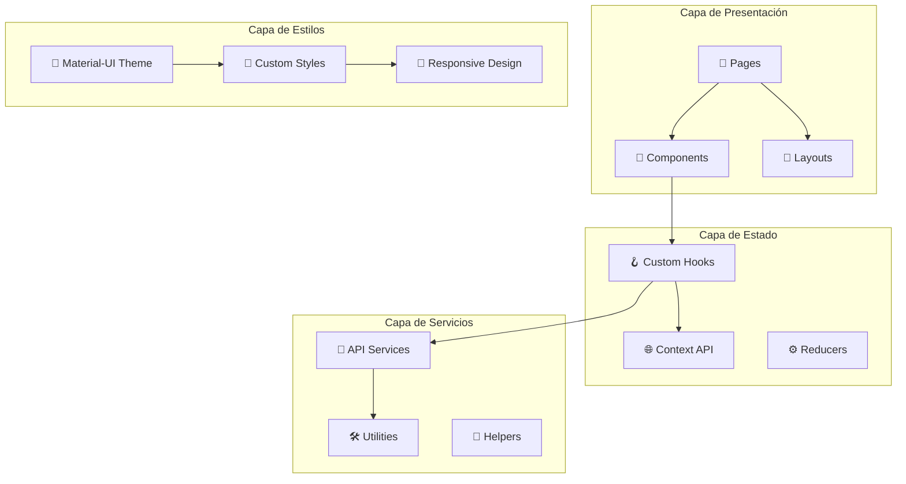

# 🎨 Documentación Frontend - Fashionista e-Boutique

## 🎯 Visión General

El frontend de **Fashionista e-Boutique** es una aplicación web moderna construida con **React 18** y **Material-UI v5**, diseñada para ofrecer una experiencia de usuario excepcional en el comercio electrónico de moda. La aplicación implementa un diseño responsive, accesible y optimizado para rendimiento.

### 🏗️ Arquitectura Frontend



---

## 🛠️ Stack Tecnológico

### 📚 Dependencias Principales

| Tecnología | Versión | Propósito | Documentación |
|------------|---------|-----------|---------------|
| **React** | 18.2.0 | Biblioteca principal | [React Docs](https://reactjs.org/) |
| **Material-UI** | 5.14.0 | Sistema de diseño | [MUI Docs](https://mui.com/) |
| **React Router** | 6.15.0 | Enrutamiento | [Router Docs](https://reactrouter.com/) |
| **Axios** | 1.5.0 | Cliente HTTP | [Axios Docs](https://axios-http.com/) |
| **React Hook Form** | 7.45.0 | Manejo de formularios | [RHF Docs](https://react-hook-form.com/) |
| **JWT Decode** | 3.1.2 | Decodificación JWT | [JWT Decode](https://github.com/auth0/jwt-decode) |

### 🎨 Dependencias de Estilo

| Tecnología | Versión | Propósito |
|------------|---------|-----------|
| **@emotion/react** | 11.11.0 | CSS-in-JS |
| **@emotion/styled** | 11.11.0 | Styled Components |
| **@mui/icons-material** | 5.14.0 | Iconografía |
| **@mui/lab** | 5.0.0-alpha.140 | Componentes experimentales |

---

## 📁 Estructura del Proyecto

```
frontend/
├── public/                          # Archivos estáticos
│   ├── index.html                   # HTML principal
│   ├── manifest.json                # PWA manifest
│   ├── favicon.ico                  # Favicon
│   └── images/                      # Imágenes estáticas
├── src/
│   ├── components/                  # Componentes reutilizables
│   │   ├── common/                  # Componentes comunes
│   │   │   ├── Header.js            # Componente Header
│   │   │   ├── Footer.js            # Componente Footer
│   │   │   ├── Navbar.js            # Navegación principal
│   │   │   ├── LoadingSpinner.js    # Indicador de carga
│   │   │   └── ErrorBoundary.js     # Manejo de errores
│   │   ├── product/                 # Componentes de productos
│   │   │   ├── ProductCard.js       # Tarjeta de producto
│   │   │   ├── ProductList.js       # Lista de productos
│   │   │   ├── ProductFilter.js     # Filtros de productos
│   │   │   ├── ProductSearch.js     # Búsqueda de productos
│   │   │   └── ReviewForm.js        # Formulario de reseñas
│   │   ├── cart/                    # Componentes del carrito
│   │   │   ├── CartItem.js          # Item del carrito
│   │   │   ├── CartSummary.js       # Resumen del carrito
│   │   │   └── CartDrawer.js        # Drawer del carrito
│   │   ├── auth/                    # Componentes de autenticación
│   │   │   ├── LoginForm.js         # Formulario de login
│   │   │   ├── RegisterForm.js      # Formulario de registro
│   │   │   └── ProtectedRoute.js    # Rutas protegidas
│   │   └── ui/                      # Componentes de UI
│   │       ├── Button.js            # Botones personalizados
│   │       ├── Input.js             # Inputs personalizados
│   │       ├── Modal.js             # Modales
│   │       └── Notification.js      # Notificaciones
│   ├── pages/                       # Páginas principales
│   │   ├── Home.js                  # Página de inicio
│   │   ├── Products.js              # Catálogo de productos
│   │   ├── ProductDetail.js         # Detalle de producto
│   │   ├── Cart.js                  # Página del carrito
│   │   ├── Checkout.js              # Proceso de compra
│   │   ├── Profile.js               # Perfil de usuario
│   │   ├── Orders.js                # Historial de pedidos
│   │   ├── About.js                 # Acerca de nosotros
│   │   ├── Contact.js               # Contacto
│   │   ├── Login.js                 # Página de login
│   │   ├── Register.js              # Página de registro
│   │   ├── Admin.js                 # Panel de administración
│   │   └── NotFound.js              # Página 404
│   ├── context/                     # Context API
│   │   ├── AuthContext.js           # Contexto de autenticación
│   │   ├── CartContext.js           # Contexto del carrito
│   │   ├── ThemeContext.js          # Contexto del tema
│   │   └── NotificationContext.js   # Contexto de notificaciones
│   ├── hooks/                       # Custom Hooks
│   │   ├── useAuth.js               # Hook de autenticación
│   │   ├── useCart.js               # Hook del carrito
│   │   ├── useApi.js                # Hook para API calls
│   │   ├── useLocalStorage.js       # Hook para localStorage
│   │   ├── useDebounce.js           # Hook de debounce
│   │   └── useInfiniteScroll.js     # Hook para scroll infinito
│   ├── services/                    # Servicios de API
│   │   ├── api.js                   # Configuración base de Axios
│   │   ├── authService.js           # Servicios de autenticación
│   │   ├── productService.js        # Servicios de productos
│   │   ├── cartService.js           # Servicios del carrito
│   │   ├── orderService.js          # Servicios de pedidos
│   │   └── userService.js           # Servicios de usuario
│   ├── utils/                       # Utilidades
│   │   ├── constants.js             # Constantes de la aplicación
│   │   ├── formatters.js            # Funciones de formato
│   │   ├── validators.js            # Validadores
│   │   ├── helpers.js               # Funciones auxiliares
│   │   └── storage.js               # Manejo de almacenamiento
│   ├── styles/                      # Estilos globales
│   │   ├── theme.js                 # Tema de Material-UI
│   │   ├── globalStyles.js          # Estilos globales
│   │   └── variables.css            # Variables CSS
│   ├── assets/                      # Recursos estáticos
│   │   ├── images/                  # Imágenes
│   │   ├── icons/                   # Iconos personalizados
│   │   └── fonts/                   # Fuentes personalizadas
│   ├── App.js                       # Componente principal
│   ├── index.js                     # Punto de entrada
│   └── setupTests.js                # Configuración de tests
├── package.json                     # Dependencias y scripts
├── .env.example                     # Variables de entorno ejemplo
├── .gitignore                       # Archivos ignorados por Git
└── README.md                        # Documentación del proyecto
```

---

## 📄 Páginas Principales

### 🏠 Home.js
**Descripción**: Página de inicio con hero section, productos destacados y categorías.

**Características**:
- Hero banner con call-to-action
- Grid de productos destacados
- Sección de categorías populares
- Testimonios de clientes
- Newsletter signup

**Componentes utilizados**:
- `ProductCard` para productos destacados
- `LoadingSpinner` para estados de carga
- Material-UI Grid, Typography, Button

### 🛍️ Products.js
**Descripción**: Catálogo completo de productos con filtros y búsqueda.

**Características**:
- Lista paginada de productos
- Filtros por categoría, precio, talla, color
- Búsqueda en tiempo real
- Ordenamiento (precio, popularidad, fecha)
- Vista de grid/lista

**Componentes utilizados**:
- `ProductList` para mostrar productos
- `ProductFilter` para filtros
- `ProductSearch` para búsqueda
- Pagination de Material-UI

### 📱 ProductDetail.js
**Descripción**: Página de detalle de producto individual.

**Características**:
- Galería de imágenes con zoom
- Información detallada del producto
- Selector de variantes (talla, color)
- Sistema de reseñas y calificaciones
- Productos relacionados
- Botón "Agregar al carrito"

**Componentes utilizados**:
- `ReviewForm` para agregar reseñas
- `ProductCard` para productos relacionados
- Material-UI ImageList, Rating, Tabs

### 🛒 Cart.js
**Descripción**: Página del carrito de compras.

**Características**:
- Lista de productos en el carrito
- Actualización de cantidades
- Eliminación de productos
- Resumen de precios
- Botón para proceder al checkout

**Componentes utilizados**:
- `CartItem` para cada producto
- `CartSummary` para el resumen
- Material-UI Table, IconButton

### 💳 Checkout.js
**Descripción**: Proceso de finalización de compra.

**Características**:
- Formulario de dirección de envío
- Selección de método de pago
- Resumen de la orden
- Validación de formularios
- Integración con pasarelas de pago

**Hooks utilizados**:
- `useCart()` para datos del carrito
- `useAuth()` para información del usuario
- React Hook Form para validación

### 👤 Profile.js
**Descripción**: Perfil del usuario autenticado.

**Características**:
- Información personal del usuario
- Edición de datos de perfil
- Cambio de contraseña
- Direcciones guardadas
- Preferencias de cuenta

**Componentes utilizados**:
- Material-UI TextField, Button, Avatar
- React Hook Form para validación

### 📋 Orders.js
**Descripción**: Historial de pedidos del usuario.

**Características**:
- Lista de pedidos realizados
- Detalles de cada pedido
- Estados de envío
- Opción de reordenar
- Filtros por fecha y estado

**Componentes utilizados**:
- Material-UI Table, Chip, Accordion
- `LoadingSpinner` para carga

### 🔐 Login.js
**Descripción**: Página de inicio de sesión.

**Características**:
- Formulario de login
- Validación en tiempo real
- Recordar sesión
- Enlace a registro
- Recuperación de contraseña

**Componentes utilizados**:
- `LoginForm` componente reutilizable
- Material-UI TextField, Checkbox

### 📝 Register.js
**Descripción**: Página de registro de nuevos usuarios.

**Características**:
- Formulario de registro completo
- Validación de contraseña segura
- Términos y condiciones
- Verificación de email único

**Componentes utilizados**:
- `RegisterForm` componente reutilizable
- Material-UI Stepper para proceso paso a paso

### ⚙️ Admin.js
**Descripción**: Panel de administración para gestión de productos.

**Características**:
- Dashboard con estadísticas
- Gestión de productos (CRUD)
- Gestión de pedidos
- Gestión de usuarios
- Reportes y analytics

**Acceso**: Solo usuarios con rol "admin"

---

## 🧩 Componentes Principales

### 🎯 Componentes Comunes

#### Header.js
```javascript
// Navegación principal de la aplicación
const Header = () => {
  const { user, logout } = useAuth();
  const { cartItems } = useCart();
  
  return (
    <AppBar position="sticky">
      <Toolbar>
        <Logo />
        <SearchBar />
        <Navigation />
        <UserMenu user={user} onLogout={logout} />
        <CartIcon itemCount={cartItems.length} />
      </Toolbar>
    </AppBar>
  );
};
```

**Características**:
- Logo y navegación principal
- Barra de búsqueda integrada
- Menú de usuario con dropdown
- Icono de carrito con contador
- Responsive design

#### Footer.js
```javascript
// Pie de página con enlaces y información
const Footer = () => {
  return (
    <Box component="footer" sx={{ mt: 'auto', py: 3, bgcolor: 'grey.100' }}>
      <Container>
        <Grid container spacing={4}>
          <Grid item xs={12} md={3}>
            <CompanyInfo />
          </Grid>
          <Grid item xs={12} md={3}>
            <QuickLinks />
          </Grid>
          <Grid item xs={12} md={3}>
            <CustomerService />
          </Grid>
          <Grid item xs={12} md={3}>
            <SocialMedia />
          </Grid>
        </Grid>
      </Container>
    </Box>
  );
};
```

### 🛍️ Componentes de Productos

#### ProductCard.js
```javascript
// Tarjeta de producto reutilizable
const ProductCard = ({ product, onAddToCart }) => {
  const [isHovered, setIsHovered] = useState(false);
  
  return (
    <Card 
      onMouseEnter={() => setIsHovered(true)}
      onMouseLeave={() => setIsHovered(false)}
      sx={{ height: '100%', display: 'flex', flexDirection: 'column' }}
    >
      <CardMedia
        component="img"
        height="200"
        image={product.images[0]?.url}
        alt={product.name}
      />
      <CardContent sx={{ flexGrow: 1 }}>
        <Typography variant="h6" component="h3">
          {product.name}
        </Typography>
        <Typography variant="body2" color="text.secondary">
          {product.description}
        </Typography>
        <Box sx={{ mt: 2, display: 'flex', justifyContent: 'space-between', alignItems: 'center' }}>
          <Typography variant="h6" color="primary">
            ${product.price}
          </Typography>
          <Rating value={product.averageRating} readOnly size="small" />
        </Box>
      </CardContent>
      <CardActions>
        <Button 
          fullWidth 
          variant="contained" 
          onClick={() => onAddToCart(product)}
          disabled={product.stock === 0}
        >
          {product.stock === 0 ? 'Agotado' : 'Agregar al Carrito'}
        </Button>
      </CardActions>
    </Card>
  );
};
```

#### ProductFilter.js
```javascript
// Componente de filtros para productos
const ProductFilter = ({ filters, onFilterChange }) => {
  return (
    <Paper sx={{ p: 2, mb: 2 }}>
      <Typography variant="h6" gutterBottom>
        Filtros
      </Typography>
      
      {/* Filtro por categoría */}
      <FormControl fullWidth margin="normal">
        <InputLabel>Categoría</InputLabel>
        <Select
          value={filters.category}
          onChange={(e) => onFilterChange('category', e.target.value)}
        >
          <MenuItem value="">Todas</MenuItem>
          <MenuItem value="ropa">Ropa</MenuItem>
          <MenuItem value="zapatos">Zapatos</MenuItem>
          <MenuItem value="accesorios">Accesorios</MenuItem>
        </Select>
      </FormControl>
      
      {/* Filtro por precio */}
      <Typography gutterBottom>Rango de Precio</Typography>
      <Slider
        value={filters.priceRange}
        onChange={(e, newValue) => onFilterChange('priceRange', newValue)}
        valueLabelDisplay="auto"
        min={0}
        max={1000}
      />
      
      {/* Filtro por talla */}
      <FormControl component="fieldset" margin="normal">
        <FormLabel component="legend">Tallas</FormLabel>
        <FormGroup>
          {['XS', 'S', 'M', 'L', 'XL'].map((size) => (
            <FormControlLabel
              key={size}
              control={
                <Checkbox
                  checked={filters.sizes.includes(size)}
                  onChange={(e) => {
                    const newSizes = e.target.checked
                      ? [...filters.sizes, size]
                      : filters.sizes.filter(s => s !== size);
                    onFilterChange('sizes', newSizes);
                  }}
                />
              }
              label={size}
            />
          ))}
        </FormGroup>
      </FormControl>
    </Paper>
  );
};
```

### 🛒 Componentes del Carrito

#### CartItem.js
```javascript
// Item individual del carrito
const CartItem = ({ item, onUpdateQuantity, onRemove }) => {
  return (
    <TableRow>
      <TableCell>
        <Box sx={{ display: 'flex', alignItems: 'center' }}>
          <Avatar
            src={item.image}
            alt={item.name}
            sx={{ width: 60, height: 60, mr: 2 }}
            variant="rounded"
          />
          <Box>
            <Typography variant="subtitle1">{item.name}</Typography>
            <Typography variant="body2" color="text.secondary">
              Talla: {item.size} | Color: {item.color}
            </Typography>
          </Box>
        </Box>
      </TableCell>
      <TableCell>
        <Typography variant="h6">${item.price}</Typography>
      </TableCell>
      <TableCell>
        <Box sx={{ display: 'flex', alignItems: 'center' }}>
          <IconButton 
            onClick={() => onUpdateQuantity(item.id, item.quantity - 1)}
            disabled={item.quantity <= 1}
          >
            <RemoveIcon />
          </IconButton>
          <Typography sx={{ mx: 2 }}>{item.quantity}</Typography>
          <IconButton 
            onClick={() => onUpdateQuantity(item.id, item.quantity + 1)}
          >
            <AddIcon />
          </IconButton>
        </Box>
      </TableCell>
      <TableCell>
        <Typography variant="h6">
          ${(item.price * item.quantity).toFixed(2)}
        </Typography>
      </TableCell>
      <TableCell>
        <IconButton onClick={() => onRemove(item.id)} color="error">
          <DeleteIcon />
        </IconButton>
      </TableCell>
    </TableRow>
  );
};
```

---

## 🌐 Context API

### 🔐 AuthContext.js
```javascript
// Contexto de autenticación global
const AuthContext = createContext();

export const AuthProvider = ({ children }) => {
  const [user, setUser] = useState(null);
  const [isAuthenticated, setIsAuthenticated] = useState(false);
  const [loading, setLoading] = useState(true);

  useEffect(() => {
    const token = localStorage.getItem('token');
    if (token) {
      try {
        const decodedToken = jwtDecode(token);
        if (decodedToken.exp * 1000 > Date.now()) {
          setUser(decodedToken);
          setIsAuthenticated(true);
        } else {
          localStorage.removeItem('token');
        }
      } catch (error) {
        localStorage.removeItem('token');
      }
    }
    setLoading(false);
  }, []);

  const login = async (email, password) => {
    try {
      const response = await authService.login(email, password);
      const { token, user } = response.data;
      
      localStorage.setItem('token', token);
      setUser(user);
      setIsAuthenticated(true);
      
      return { success: true };
    } catch (error) {
      return { 
        success: false, 
        error: error.response?.data?.message || 'Error de autenticación' 
      };
    }
  };

  const logout = () => {
    localStorage.removeItem('token');
    setUser(null);
    setIsAuthenticated(false);
  };

  const value = {
    user,
    isAuthenticated,
    loading,
    login,
    logout
  };

  return (
    <AuthContext.Provider value={value}>
      {children}
    </AuthContext.Provider>
  );
};

export const useAuth = () => {
  const context = useContext(AuthContext);
  if (!context) {
    throw new Error('useAuth debe ser usado dentro de AuthProvider');
  }
  return context;
};
```

### 🛒 CartContext.js
```javascript
// Contexto del carrito de compras
const CartContext = createContext();

export const CartProvider = ({ children }) => {
  const [cartItems, setCartItems] = useState([]);
  const [isOpen, setIsOpen] = useState(false);

  // Cargar carrito desde localStorage al iniciar
  useEffect(() => {
    const savedCart = localStorage.getItem('cart');
    if (savedCart) {
      setCartItems(JSON.parse(savedCart));
    }
  }, []);

  // Guardar carrito en localStorage cuando cambie
  useEffect(() => {
    localStorage.setItem('cart', JSON.stringify(cartItems));
  }, [cartItems]);

  const addToCart = (product, quantity = 1, selectedSize, selectedColor) => {
    const existingItem = cartItems.find(
      item => item.id === product._id && 
               item.size === selectedSize && 
               item.color === selectedColor
    );

    if (existingItem) {
      updateQuantity(existingItem.cartId, existingItem.quantity + quantity);
    } else {
      const newItem = {
        cartId: Date.now().toString(),
        id: product._id,
        name: product.name,
        price: product.price,
        image: product.images[0]?.url,
        size: selectedSize,
        color: selectedColor,
        quantity,
        stock: product.stock
      };
      setCartItems(prev => [...prev, newItem]);
    }
  };

  const removeFromCart = (cartId) => {
    setCartItems(prev => prev.filter(item => item.cartId !== cartId));
  };

  const updateQuantity = (cartId, newQuantity) => {
    if (newQuantity <= 0) {
      removeFromCart(cartId);
      return;
    }

    setCartItems(prev =>
      prev.map(item =>
        item.cartId === cartId
          ? { ...item, quantity: Math.min(newQuantity, item.stock) }
          : item
      )
    );
  };

  const clearCart = () => {
    setCartItems([]);
  };

  const getTotalItems = () => {
    return cartItems.reduce((total, item) => total + item.quantity, 0);
  };

  const getTotalPrice = () => {
    return cartItems.reduce((total, item) => total + (item.price * item.quantity), 0);
  };

  const value = {
    cartItems,
    isOpen,
    setIsOpen,
    addToCart,
    removeFromCart,
    updateQuantity,
    clearCart,
    getTotalItems,
    getTotalPrice
  };

  return (
    <CartContext.Provider value={value}>
      {children}
    </CartContext.Provider>
  );
};

export const useCart = () => {
  const context = useContext(CartContext);
  if (!context) {
    throw new Error('useCart debe ser usado dentro de CartProvider');
  }
  return context;
};
```

---

## 🪝 Custom Hooks

### 🔌 useApi.js
```javascript
// Hook personalizado para llamadas a la API
export const useApi = (url, options = {}) => {
  const [data, setData] = useState(null);
  const [loading, setLoading] = useState(true);
  const [error, setError] = useState(null);

  const fetchData = useCallback(async () => {
    try {
      setLoading(true);
      setError(null);
      
      const response = await api.get(url, options);
      setData(response.data);
    } catch (err) {
      setError(err.response?.data?.message || 'Error al cargar datos');
    } finally {
      setLoading(false);
    }
  }, [url, options]);

  useEffect(() => {
    fetchData();
  }, [fetchData]);

  const refetch = () => {
    fetchData();
  };

  return { data, loading, error, refetch };
};
```

### ⏱️ useDebounce.js
```javascript
// Hook para debounce de búsquedas
export const useDebounce = (value, delay) => {
  const [debouncedValue, setDebouncedValue] = useState(value);

  useEffect(() => {
    const handler = setTimeout(() => {
      setDebouncedValue(value);
    }, delay);

    return () => {
      clearTimeout(handler);
    };
  }, [value, delay]);

  return debouncedValue;
};
```

---

## 🎨 Sistema de Estilos

### 🎭 Tema Principal
```javascript
// src/styles/theme.js
import { createTheme } from '@mui/material/styles';

export const theme = createTheme({
  palette: {
    mode: 'light',
    primary: {
      main: '#2E7D32',
      light: '#4CAF50',
      dark: '#1B5E20',
      contrastText: '#FFFFFF'
    },
    secondary: {
      main: '#FF6B35',
      light: '#FF8A65',
      dark: '#E64A19',
      contrastText: '#FFFFFF'
    },
    background: {
      default: '#FAFAFA',
      paper: '#FFFFFF'
    }
  },
  typography: {
    fontFamily: '"Roboto", "Arial", sans-serif',
    h1: {
      fontSize: '2.5rem',
      fontWeight: 700
    },
    button: {
      textTransform: 'none',
      fontWeight: 500
    }
  },
  shape: {
    borderRadius: 8
  },
  components: {
    MuiButton: {
      styleOverrides: {
        root: {
          borderRadius: 8,
          boxShadow: 'none',
          '&:hover': {
            boxShadow: '0 2px 8px rgba(0,0,0,0.15)'
          }
        }
      }
    },
    MuiCard: {
      styleOverrides: {
        root: {
          borderRadius: 12,
          boxShadow: '0 2px 12px rgba(0,0,0,0.08)'
        }
      }
    }
  }
});
```

---

## 🚀 Optimizaciones de Rendimiento

### 📦 Code Splitting
```javascript
// Lazy loading de páginas
const Home = lazy(() => import('./pages/Home'));
const Products = lazy(() => import('./pages/Products'));
const ProductDetail = lazy(() => import('./pages/ProductDetail'));

// En App.js
<Suspense fallback={<LoadingSpinner />}>
  <Routes>
    <Route path="/" element={<Home />} />
    <Route path="/products" element={<Products />} />
    <Route path="/products/:id" element={<ProductDetail />} />
  </Routes>
</Suspense>
```

### 🎯 Memoización
```javascript
// Memoización de componentes costosos
const ProductCard = memo(({ product, onAddToCart }) => {
  // Componente memoizado
}, (prevProps, nextProps) => {
  return prevProps.product.id === nextProps.product.id &&
         prevProps.product.price === nextProps.product.price;
});

// Memoización de callbacks
const handleAddToCart = useCallback((product) => {
  addToCart(product);
}, [addToCart]);
```

---

## 📱 Responsive Design

### 🎯 Breakpoints
```javascript
// Breakpoints de Material-UI
const theme = createTheme({
  breakpoints: {
    values: {
      xs: 0,      // móviles pequeños
      sm: 600,    // móviles grandes
      md: 900,    // tablets
      lg: 1200,   // desktop
      xl: 1536    // desktop grande
    }
  }
});
```

### 📐 Grid System
```javascript
// Uso del sistema de grid responsive
<Grid container spacing={2}>
  <Grid item xs={12} sm={6} md={4} lg={3}>
    <ProductCard product={product} />
  </Grid>
</Grid>
```

---

## 🔒 Seguridad

### 🛡️ Rutas Protegidas
```javascript
// Componente para proteger rutas
const ProtectedRoute = ({ children, requireAdmin = false }) => {
  const { isAuthenticated, user } = useAuth();

  if (!isAuthenticated) {
    return <Navigate to="/login" replace />;
  }

  if (requireAdmin && user?.role !== 'admin') {
    return <Navigate to="/" replace />;
  }

  return children;
};
```

### 🔐 Sanitización de Datos
```javascript
// Sanitización de inputs
const sanitizeInput = (input) => {
  return input.replace(/<script\b[^<]*(?:(?!<\/script>)<[^<]*)*<\/script>/gi, '');
};
```

---

## 🧪 Testing

### 🎯 Configuración de Tests
```javascript
// setupTests.js
import '@testing-library/jest-dom';
import { configure } from '@testing-library/react';

configure({ testIdAttribute: 'data-testid' });
```

### 🧪 Ejemplo de Test
```javascript
// ProductCard.test.js
import { render, screen, fireEvent } from '@testing-library/react';
import { ProductCard } from './ProductCard';

describe('ProductCard', () => {
  const mockProduct = {
    id: '1',
    name: 'Test Product',
    price: 99.99,
    images: [{ url: 'test.jpg' }]
  };

  test('renders product information', () => {
    render(<ProductCard product={mockProduct} />);
    
    expect(screen.getByText('Test Product')).toBeInTheDocument();
    expect(screen.getByText('$99.99')).toBeInTheDocument();
  });

  test('calls onAddToCart when button is clicked', () => {
    const mockAddToCart = jest.fn();
    render(<ProductCard product={mockProduct} onAddToCart={mockAddToCart} />);
    
    fireEvent.click(screen.getByText('Agregar al Carrito'));
    expect(mockAddToCart).toHaveBeenCalledWith(mockProduct);
  });
});
```

---

## 🚀 Scripts de Desarrollo

```json
{
  "scripts": {
    "start": "react-scripts start",
    "build": "react-scripts build",
    "test": "react-scripts test",
    "eject": "react-scripts eject",
    "lint": "eslint src --ext .js,.jsx",
    "lint:fix": "eslint src --ext .js,.jsx --fix",
    "format": "prettier --write src/**/*.{js,jsx,css,md}"
  }
}
```

---

## 🌍 Variables de Entorno

```bash
# .env.example
REACT_APP_API_URL=http://localhost:5000/api
REACT_APP_ENVIRONMENT=development
REACT_APP_GOOGLE_ANALYTICS_ID=GA_TRACKING_ID
REACT_APP_STRIPE_PUBLIC_KEY=pk_test_...
```

---

## 📚 Recursos Adicionales

- [Material-UI Documentation](https://mui.com/)
- [React Router Documentation](https://reactrouter.com/)
- [React Hook Form Documentation](https://react-hook-form.com/)
- [Axios Documentation](https://axios-http.com/)
- [React Testing Library](https://testing-library.com/docs/react-testing-library/intro/)

---

*Documentación actualizada: Enero 2024*