# 🧪 Documentación de Testing - Fashionista e-Boutique

## 🎯 Visión General

La estrategia de testing de **Fashionista e-Boutique** está diseñada para garantizar la calidad, confiabilidad y mantenibilidad del código. Implementamos un enfoque integral que abarca desde pruebas unitarias hasta pruebas end-to-end, siguiendo las mejores prácticas de la industria.

### 🏗️ Arquitectura de Testing

```mermaid
graph TB
    subgraph "Frontend Testing"
        UNIT_F[🧩 Unit Tests]
        COMP_F[⚛️ Component Tests]
        INT_F[🔗 Integration Tests]
        E2E_F[🌐 E2E Tests]
    end
    
    subgraph "Backend Testing"
        UNIT_B[🧩 Unit Tests]
        INT_B[🔗 Integration Tests]
        API_B[🔌 API Tests]
        DB_B[🗄️ Database Tests]
    end
    
    subgraph "Testing Tools"
        JEST[Jest]
        RTL[React Testing Library]
        CYPRESS[Cypress]
        SUPERTEST[Supertest]
    end
    
    UNIT_F --> JEST
    COMP_F --> RTL
    INT_F --> RTL
    E2E_F --> CYPRESS
    
    UNIT_B --> JEST
    INT_B --> SUPERTEST
    API_B --> SUPERTEST
    DB_B --> JEST
```



---

## 📊 Estrategia de Testing

### 🔺 Pirámide de Testing

```
        /\
       /  \     🌐 E2E Tests (10%)
      /____\    Flujos completos de usuario
     /      \   🔗 Integration Tests (20%)
    /        \  Interacción entre módulos
   /          \ 🧩 Unit Tests (70%)
  /__________\ Funciones y componentes aislados
```

### 📈 Objetivos de Cobertura

| Tipo de Test | Cobertura Objetivo | Herramientas |
|--------------|-------------------|--------------|
| **Unit Tests** | 90%+ | Jest, React Testing Library |
| **Integration Tests** | 80%+ | Jest, Supertest |
| **E2E Tests** | Flujos críticos | Cypress |
| **API Tests** | 95%+ | Supertest, Jest |

---

## 🖥️ Testing Frontend

### 🛠️ Configuración

#### 📦 Dependencias

```json
{
  "devDependencies": {
    "@testing-library/react": "^13.4.0",
    "@testing-library/jest-dom": "^5.16.5",
    "@testing-library/user-event": "^14.4.3",
    "jest": "^27.5.1",
    "jest-environment-jsdom": "^27.5.1",
    "cypress": "^12.17.0",
    "msw": "^1.2.3"
  }
}
```

#### ⚙️ Configuración Jest

```javascript
// jest.config.js
module.exports = {
  testEnvironment: 'jsdom',
  setupFilesAfterEnv: ['<rootDir>/src/setupTests.js'],
  moduleNameMapping: {
    '\\.(css|less|scss|sass)$': 'identity-obj-proxy',
    '\\.(jpg|jpeg|png|gif|eot|otf|webp|svg|ttf|woff|woff2|mp4|webm|wav|mp3|m4a|aac|oga)$': '<rootDir>/__mocks__/fileMock.js'
  },
  collectCoverageFrom: [
    'src/**/*.{js,jsx}',
    '!src/index.js',
    '!src/reportWebVitals.js',
    '!src/**/*.stories.{js,jsx}',
    '!src/**/*.test.{js,jsx}'
  ],
  coverageThreshold: {
    global: {
      branches: 80,
      functions: 80,
      lines: 80,
      statements: 80
    }
  },
  testMatch: [
    '<rootDir>/src/**/__tests__/**/*.{js,jsx}',
    '<rootDir>/src/**/*.{test,spec}.{js,jsx}'
  ]
};
```

#### 🔧 Setup de Testing

```javascript
// src/setupTests.js
import '@testing-library/jest-dom';
import { configure } from '@testing-library/react';
import { server } from './mocks/server';

// Configurar React Testing Library
configure({ testIdAttribute: 'data-testid' });

// Configurar MSW
beforeAll(() => server.listen());
afterEach(() => server.resetHandlers());
afterAll(() => server.close());

// Mock de IntersectionObserver
global.IntersectionObserver = class IntersectionObserver {
  constructor() {}
  disconnect() {}
  observe() {}
  unobserve() {}
};

// Mock de matchMedia
Object.defineProperty(window, 'matchMedia', {
  writable: true,
  value: jest.fn().mockImplementation(query => ({
    matches: false,
    media: query,
    onchange: null,
    addListener: jest.fn(),
    removeListener: jest.fn(),
    addEventListener: jest.fn(),
    removeEventListener: jest.fn(),
    dispatchEvent: jest.fn(),
  })),
});

// Mock de localStorage
const localStorageMock = {
  getItem: jest.fn(),
  setItem: jest.fn(),
  removeItem: jest.fn(),
  clear: jest.fn(),
};
global.localStorage = localStorageMock;
```

### 🧩 Unit Tests - Componentes

#### 🛍️ Ejemplo: ProductCard Test

```javascript
// src/components/product/ProductCard/ProductCard.test.jsx
import React from 'react';
import { render, screen, fireEvent, waitFor } from '@testing-library/react';
import userEvent from '@testing-library/user-event';
import { BrowserRouter } from 'react-router-dom';
import { ThemeProvider } from '@mui/material/styles';
import ProductCard from './ProductCard';
import { CartProvider } from '../../../context/CartContext';
import theme from '../../../styles/theme';

// Mock del hook useCart
jest.mock('../../../hooks/useCart', () => ({
  useCart: () => ({
    addToCart: jest.fn().mockResolvedValue({}),
  }),
}));

const mockProduct = {
  _id: '1',
  name: 'Vestido Elegante',
  shortDescription: 'Vestido perfecto para ocasiones especiales',
  price: 89.99,
  originalPrice: 120.00,
  images: [{ url: '/images/dress1.jpg' }],
  rating: 4.5,
  reviewCount: 23,
  stock: { quantity: 10 },
  isFeatured: true
};

const renderWithProviders = (component) => {
  return render(
    <BrowserRouter>
      <ThemeProvider theme={theme}>
        <CartProvider>
          {component}
        </CartProvider>
      </ThemeProvider>
    </BrowserRouter>
  );
};

describe('ProductCard', () => {
  test('renderiza la información del producto correctamente', () => {
    renderWithProviders(<ProductCard product={mockProduct} />);
    
    expect(screen.getByText('Vestido Elegante')).toBeInTheDocument();
    expect(screen.getByText('Vestido perfecto para ocasiones especiales')).toBeInTheDocument();
    expect(screen.getByText('$89.99')).toBeInTheDocument();
    expect(screen.getByText('$120.00')).toBeInTheDocument();
    expect(screen.getByText('Destacado')).toBeInTheDocument();
    expect(screen.getByText('-25%')).toBeInTheDocument();
  });

  test('muestra el rating correctamente', () => {
    renderWithProviders(<ProductCard product={mockProduct} />);
    
    const rating = screen.getByRole('img', { name: /4.5 stars/i });
    expect(rating).toBeInTheDocument();
    expect(screen.getByText('(23)')).toBeInTheDocument();
  });

  test('permite agregar producto al carrito', async () => {
    const user = userEvent.setup();
    renderWithProviders(<ProductCard product={mockProduct} />);
    
    const addButton = screen.getByRole('button', { name: /agregar/i });
    await user.click(addButton);
    
    // Verificar que se llamó la función addToCart
    // (esto requeriría un mock más específico del contexto)
  });

  test('muestra "Agotado" cuando no hay stock', () => {
    const outOfStockProduct = { ...mockProduct, stock: { quantity: 0 } };
    renderWithProviders(<ProductCard product={outOfStockProduct} />);
    
    const addButton = screen.getByRole('button', { name: /agotado/i });
    expect(addButton).toBeDisabled();
  });

  test('navega al detalle del producto al hacer click', async () => {
    const user = userEvent.setup();
    renderWithProviders(<ProductCard product={mockProduct} />);
    
    const card = screen.getByRole('img', { name: /vestido elegante/i }).closest('div').closest('div');
    await user.click(card);
    
    // Verificar navegación (requeriría mock del router)
  });
});
```

#### 🪝 Ejemplo: Custom Hook Test

```javascript
// src/hooks/useCart.test.js
import { renderHook, act } from '@testing-library/react';
import { useCartActions } from './useCart';
import { CartProvider } from '../context/CartContext';
import * as cartService from '../services/cartService';

// Mock del servicio
jest.mock('../services/cartService');

const wrapper = ({ children }) => <CartProvider>{children}</CartProvider>;

describe('useCartActions', () => {
  beforeEach(() => {
    jest.clearAllMocks();
  });

  test('addToCart agrega producto correctamente', async () => {
    const mockResponse = {
      data: {
        items: [{ product: { _id: '1' }, quantity: 1 }],
        total: 89.99
      }
    };
    cartService.addItem.mockResolvedValue(mockResponse);

    const { result } = renderHook(() => useCartActions(), { wrapper });

    await act(async () => {
      await result.current.addToCart({ _id: '1', price: 89.99 }, 1);
    });

    expect(cartService.addItem).toHaveBeenCalledWith('1', 1);
  });

  test('maneja errores al agregar al carrito', async () => {
    cartService.addItem.mockRejectedValue(new Error('Error de red'));

    const { result } = renderHook(() => useCartActions(), { wrapper });

    await expect(
      act(async () => {
        await result.current.addToCart({ _id: '1' }, 1);
      })
    ).rejects.toThrow('Error de red');
  });
});
```

### 🔗 Integration Tests

#### 📄 Ejemplo: Página de Productos

```javascript
// src/pages/Products/Products.integration.test.jsx
import React from 'react';
import { render, screen, waitFor, fireEvent } from '@testing-library/react';
import userEvent from '@testing-library/user-event';
import { BrowserRouter } from 'react-router-dom';
import Products from './Products';
import { server } from '../../mocks/server';
import { rest } from 'msw';

const renderWithRouter = (component) => {
  return render(<BrowserRouter>{component}</BrowserRouter>);
};

describe('Products Page Integration', () => {
  test('carga y muestra productos desde la API', async () => {
    renderWithRouter(<Products />);

    // Verificar loading state
    expect(screen.getByText(/cargando/i)).toBeInTheDocument();

    // Esperar a que se carguen los productos
    await waitFor(() => {
      expect(screen.getByText('Vestido Elegante')).toBeInTheDocument();
    });

    expect(screen.queryByText(/cargando/i)).not.toBeInTheDocument();
  });

  test('filtra productos por categoría', async () => {
    const user = userEvent.setup();
    renderWithRouter(<Products />);

    await waitFor(() => {
      expect(screen.getByText('Vestido Elegante')).toBeInTheDocument();
    });

    // Seleccionar filtro de categoría
    const categoryFilter = screen.getByLabelText(/categoría/i);
    await user.selectOptions(categoryFilter, 'vestidos');

    // Verificar que se filtran los productos
    await waitFor(() => {
      expect(screen.getByText('Vestido Elegante')).toBeInTheDocument();
    });
  });

  test('busca productos por texto', async () => {
    const user = userEvent.setup();
    renderWithRouter(<Products />);

    await waitFor(() => {
      expect(screen.getByText('Vestido Elegante')).toBeInTheDocument();
    });

    // Buscar producto
    const searchInput = screen.getByPlaceholderText(/buscar productos/i);
    await user.type(searchInput, 'vestido');

    // Verificar resultados de búsqueda
    await waitFor(() => {
      expect(screen.getByText('Vestido Elegante')).toBeInTheDocument();
    });
  });

  test('maneja errores de API correctamente', async () => {
    // Mock error response
    server.use(
      rest.get('/api/products', (req, res, ctx) => {
        return res(ctx.status(500), ctx.json({ message: 'Error del servidor' }));
      })
    );

    renderWithRouter(<Products />);

    await waitFor(() => {
      expect(screen.getByText(/error al cargar productos/i)).toBeInTheDocument();
    });
  });
});
```

### 🌐 E2E Tests con Cypress

#### ⚙️ Configuración Cypress

```javascript
// cypress.config.js
const { defineConfig } = require('cypress');

module.exports = defineConfig({
  e2e: {
    baseUrl: 'http://localhost:3000',
    supportFile: 'cypress/support/e2e.js',
    specPattern: 'cypress/e2e/**/*.cy.{js,jsx,ts,tsx}',
    viewportWidth: 1280,
    viewportHeight: 720,
    video: true,
    screenshotOnRunFailure: true,
    defaultCommandTimeout: 10000,
    requestTimeout: 10000,
    responseTimeout: 10000,
    env: {
      apiUrl: 'http://localhost:5000/api'
    }
  }
});
```

#### 🛒 Ejemplo: Flujo de Compra E2E

```javascript
// cypress/e2e/shopping-flow.cy.js
describe('Flujo de Compra Completo', () => {
  beforeEach(() => {
    // Limpiar datos y configurar estado inicial
    cy.task('db:seed');
    cy.visit('/');
  });

  it('permite completar una compra exitosa', () => {
    // 1. Navegar a productos
    cy.get('[data-testid="products-link"]').click();
    cy.url().should('include', '/products');

    // 2. Buscar producto
    cy.get('[data-testid="search-input"]').type('vestido');
    cy.get('[data-testid="search-button"]').click();

    // 3. Seleccionar producto
    cy.get('[data-testid="product-card"]').first().click();
    cy.url().should('include', '/products/');

    // 4. Agregar al carrito
    cy.get('[data-testid="add-to-cart-button"]').click();
    cy.get('[data-testid="cart-notification"]').should('be.visible');

    // 5. Ir al carrito
    cy.get('[data-testid="cart-icon"]').click();
    cy.get('[data-testid="cart-drawer"]').should('be.visible');

    // 6. Proceder al checkout
    cy.get('[data-testid="checkout-button"]').click();
    cy.url().should('include', '/checkout');

    // 7. Llenar información de envío
    cy.get('[data-testid="shipping-form"]').within(() => {
      cy.get('input[name="fullName"]').type('Juan Pérez');
      cy.get('input[name="address"]').type('Calle Principal 123');
      cy.get('input[name="city"]').type('Ciudad');
      cy.get('input[name="postalCode"]').type('12345');
      cy.get('input[name="phone"]').type('555-1234');
    });

    // 8. Seleccionar método de pago
    cy.get('[data-testid="payment-method-card"]').click();

    // 9. Completar compra
    cy.get('[data-testid="place-order-button"]').click();

    // 10. Verificar confirmación
    cy.get('[data-testid="order-confirmation"]').should('be.visible');
    cy.get('[data-testid="order-number"]').should('exist');
  });

  it('maneja errores de validación en checkout', () => {
    // Agregar producto al carrito primero
    cy.visit('/products');
    cy.get('[data-testid="product-card"]').first().click();
    cy.get('[data-testid="add-to-cart-button"]').click();
    cy.get('[data-testid="cart-icon"]').click();
    cy.get('[data-testid="checkout-button"]').click();

    // Intentar completar sin llenar campos requeridos
    cy.get('[data-testid="place-order-button"]').click();

    // Verificar mensajes de error
    cy.get('[data-testid="error-fullName"]').should('be.visible');
    cy.get('[data-testid="error-address"]').should('be.visible');
    cy.get('[data-testid="error-city"]').should('be.visible');
  });
});
```

#### 🔐 Ejemplo: Autenticación E2E

```javascript
// cypress/e2e/authentication.cy.js
describe('Autenticación de Usuario', () => {
  beforeEach(() => {
    cy.task('db:seed');
  });

  it('permite registro de nuevo usuario', () => {
    cy.visit('/register');

    cy.get('input[name="fullName"]').type('Nuevo Usuario');
    cy.get('input[name="email"]').type('nuevo@ejemplo.com');
    cy.get('input[name="password"]').type('password123');
    cy.get('input[name="confirmPassword"]').type('password123');

    cy.get('[data-testid="register-button"]').click();

    // Verificar redirección y autenticación
    cy.url().should('eq', Cypress.config().baseUrl + '/');
    cy.get('[data-testid="user-menu"]').should('be.visible');
  });

  it('permite login de usuario existente', () => {
    cy.visit('/login');

    cy.get('input[name="email"]').type('usuario@ejemplo.com');
    cy.get('input[name="password"]').type('password123');

    cy.get('[data-testid="login-button"]').click();

    // Verificar autenticación exitosa
    cy.url().should('eq', Cypress.config().baseUrl + '/');
    cy.get('[data-testid="user-menu"]').should('be.visible');
  });

  it('maneja credenciales incorrectas', () => {
    cy.visit('/login');

    cy.get('input[name="email"]').type('usuario@ejemplo.com');
    cy.get('input[name="password"]').type('passwordIncorrecto');

    cy.get('[data-testid="login-button"]').click();

    // Verificar mensaje de error
    cy.get('[data-testid="error-message"]').should('contain', 'Credenciales incorrectas');
    cy.url().should('include', '/login');
  });
});
```

---

## 🖥️ Testing Backend

### 🛠️ Configuración

#### 📦 Dependencias

```json
{
  "devDependencies": {
    "jest": "^29.5.0",
    "supertest": "^6.3.3",
    "mongodb-memory-server": "^8.12.2",
    "cross-env": "^7.0.3",
    "@types/jest": "^29.5.1"
  }
}
```

#### ⚙️ Configuración Jest

```javascript
// jest.config.js
module.exports = {
  testEnvironment: 'node',
  setupFilesAfterEnv: ['<rootDir>/tests/setup.js'],
  testMatch: [
    '**/__tests__/**/*.js',
    '**/?(*.)+(spec|test).js'
  ],
  collectCoverageFrom: [
    'controllers/**/*.js',
    'models/**/*.js',
    'middleware/**/*.js',
    'utils/**/*.js',
    'services/**/*.js',
    '!**/node_modules/**',
    '!**/coverage/**',
    '!**/tests/**'
  ],
  coverageThreshold: {
    global: {
      branches: 85,
      functions: 85,
      lines: 85,
      statements: 85
    }
  },
  testTimeout: 30000
};
```

#### 🔧 Setup de Testing

```javascript
// tests/setup.js
const { MongoMemoryServer } = require('mongodb-memory-server');
const mongoose = require('mongoose');

let mongoServer;

beforeAll(async () => {
  mongoServer = await MongoMemoryServer.create();
  const mongoUri = mongoServer.getUri();
  
  await mongoose.connect(mongoUri, {
    useNewUrlParser: true,
    useUnifiedTopology: true,
  });
});

afterAll(async () => {
  await mongoose.disconnect();
  await mongoServer.stop();
});

afterEach(async () => {
  const collections = mongoose.connection.collections;
  for (const key in collections) {
    const collection = collections[key];
    await collection.deleteMany({});
  }
});
```

### 🧩 Unit Tests - Modelos

#### 👤 Ejemplo: User Model Test

```javascript
// tests/models/User.test.js
const User = require('../../models/User');
const mongoose = require('mongoose');

describe('User Model', () => {
  describe('Validaciones', () => {
    test('crea usuario válido correctamente', async () => {
      const userData = {
        fullName: 'Juan Pérez',
        email: 'juan@ejemplo.com',
        password: 'password123'
      };

      const user = new User(userData);
      const savedUser = await user.save();

      expect(savedUser._id).toBeDefined();
      expect(savedUser.fullName).toBe(userData.fullName);
      expect(savedUser.email).toBe(userData.email);
      expect(savedUser.password).not.toBe(userData.password); // Debe estar hasheada
      expect(savedUser.role).toBe('customer'); // Valor por defecto
    });

    test('requiere campos obligatorios', async () => {
      const user = new User({});

      let error;
      try {
        await user.save();
      } catch (err) {
        error = err;
      }

      expect(error).toBeDefined();
      expect(error.errors.fullName).toBeDefined();
      expect(error.errors.email).toBeDefined();
      expect(error.errors.password).toBeDefined();
    });

    test('valida formato de email', async () => {
      const user = new User({
        fullName: 'Juan Pérez',
        email: 'email-invalido',
        password: 'password123'
      });

      let error;
      try {
        await user.save();
      } catch (err) {
        error = err;
      }

      expect(error).toBeDefined();
      expect(error.errors.email).toBeDefined();
    });

    test('requiere email único', async () => {
      const userData = {
        fullName: 'Juan Pérez',
        email: 'juan@ejemplo.com',
        password: 'password123'
      };

      await User.create(userData);

      const duplicateUser = new User(userData);
      
      let error;
      try {
        await duplicateUser.save();
      } catch (err) {
        error = err;
      }

      expect(error).toBeDefined();
      expect(error.code).toBe(11000); // Código de error de duplicado en MongoDB
    });
  });

  describe('Métodos', () => {
    test('comparePassword funciona correctamente', async () => {
      const password = 'password123';
      const user = new User({
        fullName: 'Juan Pérez',
        email: 'juan@ejemplo.com',
        password
      });

      await user.save();

      const isMatch = await user.comparePassword(password);
      const isNotMatch = await user.comparePassword('passwordIncorrecto');

      expect(isMatch).toBe(true);
      expect(isNotMatch).toBe(false);
    });

    test('toJSON excluye campos sensibles', async () => {
      const user = new User({
        fullName: 'Juan Pérez',
        email: 'juan@ejemplo.com',
        password: 'password123'
      });

      await user.save();
      const userJSON = user.toJSON();

      expect(userJSON.password).toBeUndefined();
      expect(userJSON.__v).toBeUndefined();
      expect(userJSON.fullName).toBeDefined();
      expect(userJSON.email).toBeDefined();
    });
  });
});
```

### 🔌 API Tests

#### 🔐 Ejemplo: Auth Controller Test

```javascript
// tests/controllers/auth.test.js
const request = require('supertest');
const app = require('../../server');
const User = require('../../models/User');

describe('Auth Controller', () => {
  describe('POST /api/auth/register', () => {
    test('registra nuevo usuario correctamente', async () => {
      const userData = {
        fullName: 'Juan Pérez',
        email: 'juan@ejemplo.com',
        password: 'password123'
      };

      const response = await request(app)
        .post('/api/auth/register')
        .send(userData)
        .expect(201);

      expect(response.body.success).toBe(true);
      expect(response.body.data.user).toBeDefined();
      expect(response.body.data.token).toBeDefined();
      expect(response.body.data.user.email).toBe(userData.email);
      expect(response.body.data.user.password).toBeUndefined();

      // Verificar que el usuario se guardó en la base de datos
      const savedUser = await User.findOne({ email: userData.email });
      expect(savedUser).toBeDefined();
    });

    test('rechaza registro con email duplicado', async () => {
      const userData = {
        fullName: 'Juan Pérez',
        email: 'juan@ejemplo.com',
        password: 'password123'
      };

      // Crear usuario primero
      await User.create(userData);

      const response = await request(app)
        .post('/api/auth/register')
        .send(userData)
        .expect(400);

      expect(response.body.success).toBe(false);
      expect(response.body.message).toContain('email');
    });

    test('valida campos requeridos', async () => {
      const response = await request(app)
        .post('/api/auth/register')
        .send({})
        .expect(400);

      expect(response.body.success).toBe(false);
      expect(response.body.message).toBeDefined();
    });
  });

  describe('POST /api/auth/login', () => {
    beforeEach(async () => {
      // Crear usuario de prueba
      await User.create({
        fullName: 'Juan Pérez',
        email: 'juan@ejemplo.com',
        password: 'password123'
      });
    });

    test('autentica usuario correctamente', async () => {
      const loginData = {
        email: 'juan@ejemplo.com',
        password: 'password123'
      };

      const response = await request(app)
        .post('/api/auth/login')
        .send(loginData)
        .expect(200);

      expect(response.body.success).toBe(true);
      expect(response.body.data.user).toBeDefined();
      expect(response.body.data.token).toBeDefined();
      expect(response.body.data.user.email).toBe(loginData.email);
    });

    test('rechaza credenciales incorrectas', async () => {
      const loginData = {
        email: 'juan@ejemplo.com',
        password: 'passwordIncorrecto'
      };

      const response = await request(app)
        .post('/api/auth/login')
        .send(loginData)
        .expect(401);

      expect(response.body.success).toBe(false);
      expect(response.body.message).toContain('credenciales');
    });

    test('rechaza usuario inexistente', async () => {
      const loginData = {
        email: 'noexiste@ejemplo.com',
        password: 'password123'
      };

      const response = await request(app)
        .post('/api/auth/login')
        .send(loginData)
        .expect(401);

      expect(response.body.success).toBe(false);
    });
  });
});
```

#### 🛍️ Ejemplo: Products Controller Test

```javascript
// tests/controllers/products.test.js
const request = require('supertest');
const app = require('../../server');
const Product = require('../../models/Product');
const User = require('../../models/User');

describe('Products Controller', () => {
  let authToken;
  let adminToken;

  beforeEach(async () => {
    // Crear usuario normal
    const user = await User.create({
      fullName: 'Usuario Normal',
      email: 'usuario@ejemplo.com',
      password: 'password123'
    });

    // Crear admin
    const admin = await User.create({
      fullName: 'Admin',
      email: 'admin@ejemplo.com',
      password: 'password123',
      role: 'admin'
    });

    // Obtener tokens
    const userLogin = await request(app)
      .post('/api/auth/login')
      .send({ email: 'usuario@ejemplo.com', password: 'password123' });
    authToken = userLogin.body.data.token;

    const adminLogin = await request(app)
      .post('/api/auth/login')
      .send({ email: 'admin@ejemplo.com', password: 'password123' });
    adminToken = adminLogin.body.data.token;

    // Crear productos de prueba
    await Product.create([
      {
        name: 'Vestido Elegante',
        description: 'Vestido perfecto para ocasiones especiales',
        price: 89.99,
        category: 'vestidos',
        stock: { quantity: 10 },
        images: [{ url: '/images/dress1.jpg' }]
      },
      {
        name: 'Blusa Casual',
        description: 'Blusa cómoda para el día a día',
        price: 45.99,
        category: 'blusas',
        stock: { quantity: 15 },
        images: [{ url: '/images/blouse1.jpg' }]
      }
    ]);
  });

  describe('GET /api/products', () => {
    test('obtiene lista de productos', async () => {
      const response = await request(app)
        .get('/api/products')
        .expect(200);

      expect(response.body.success).toBe(true);
      expect(response.body.data.products).toHaveLength(2);
      expect(response.body.data.pagination).toBeDefined();
    });

    test('filtra productos por categoría', async () => {
      const response = await request(app)
        .get('/api/products?category=vestidos')
        .expect(200);

      expect(response.body.success).toBe(true);
      expect(response.body.data.products).toHaveLength(1);
      expect(response.body.data.products[0].category).toBe('vestidos');
    });

    test('busca productos por texto', async () => {
      const response = await request(app)
        .get('/api/products?search=vestido')
        .expect(200);

      expect(response.body.success).toBe(true);
      expect(response.body.data.products).toHaveLength(1);
      expect(response.body.data.products[0].name).toContain('Vestido');
    });

    test('pagina resultados correctamente', async () => {
      const response = await request(app)
        .get('/api/products?page=1&limit=1')
        .expect(200);

      expect(response.body.success).toBe(true);
      expect(response.body.data.products).toHaveLength(1);
      expect(response.body.data.pagination.currentPage).toBe(1);
      expect(response.body.data.pagination.totalPages).toBe(2);
    });
  });

  describe('POST /api/products', () => {
    test('admin puede crear producto', async () => {
      const productData = {
        name: 'Nuevo Producto',
        description: 'Descripción del nuevo producto',
        price: 99.99,
        category: 'accesorios',
        stock: { quantity: 20 },
        images: [{ url: '/images/new-product.jpg' }]
      };

      const response = await request(app)
        .post('/api/products')
        .set('Authorization', `Bearer ${adminToken}`)
        .send(productData)
        .expect(201);

      expect(response.body.success).toBe(true);
      expect(response.body.data.product.name).toBe(productData.name);

      // Verificar que se guardó en la base de datos
      const savedProduct = await Product.findById(response.body.data.product._id);
      expect(savedProduct).toBeDefined();
    });

    test('usuario normal no puede crear producto', async () => {
      const productData = {
        name: 'Nuevo Producto',
        description: 'Descripción del nuevo producto',
        price: 99.99,
        category: 'accesorios'
      };

      const response = await request(app)
        .post('/api/products')
        .set('Authorization', `Bearer ${authToken}`)
        .send(productData)
        .expect(403);

      expect(response.body.success).toBe(false);
    });

    test('requiere autenticación', async () => {
      const productData = {
        name: 'Nuevo Producto',
        price: 99.99
      };

      const response = await request(app)
        .post('/api/products')
        .send(productData)
        .expect(401);

      expect(response.body.success).toBe(false);
    });
  });
});
```

### 🔗 Integration Tests

#### 🛒 Ejemplo: Flujo de Pedido

```javascript
// tests/integration/order-flow.test.js
const request = require('supertest');
const app = require('../../server');
const User = require('../../models/User');
const Product = require('../../models/Product');
const Order = require('../../models/Order');

describe('Flujo de Pedido Completo', () => {
  let authToken;
  let userId;
  let productId;

  beforeEach(async () => {
    // Crear usuario
    const user = await User.create({
      fullName: 'Juan Pérez',
      email: 'juan@ejemplo.com',
      password: 'password123'
    });
    userId = user._id;

    // Autenticar usuario
    const loginResponse = await request(app)
      .post('/api/auth/login')
      .send({ email: 'juan@ejemplo.com', password: 'password123' });
    authToken = loginResponse.body.data.token;

    // Crear producto
    const product = await Product.create({
      name: 'Vestido Elegante',
      description: 'Vestido perfecto para ocasiones especiales',
      price: 89.99,
      category: 'vestidos',
      stock: { quantity: 10 },
      images: [{ url: '/images/dress1.jpg' }]
    });
    productId = product._id;
  });

  test('flujo completo: agregar al carrito y crear pedido', async () => {
    // 1. Agregar producto al carrito
    const addToCartResponse = await request(app)
      .post('/api/cart/add')
      .set('Authorization', `Bearer ${authToken}`)
      .send({
        productId: productId,
        quantity: 2
      })
      .expect(200);

    expect(addToCartResponse.body.success).toBe(true);
    expect(addToCartResponse.body.data.items).toHaveLength(1);
    expect(addToCartResponse.body.data.items[0].quantity).toBe(2);

    // 2. Obtener carrito
    const cartResponse = await request(app)
      .get('/api/cart')
      .set('Authorization', `Bearer ${authToken}`)
      .expect(200);

    expect(cartResponse.body.data.items).toHaveLength(1);
    expect(cartResponse.body.data.total).toBe(179.98); // 89.99 * 2

    // 3. Crear pedido
    const orderData = {
      shippingAddress: {
        fullName: 'Juan Pérez',
        address: 'Calle Principal 123',
        city: 'Ciudad',
        postalCode: '12345',
        phone: '555-1234'
      },
      paymentMethod: 'card'
    };

    const orderResponse = await request(app)
      .post('/api/orders')
      .set('Authorization', `Bearer ${authToken}`)
      .send(orderData)
      .expect(201);

    expect(orderResponse.body.success).toBe(true);
    expect(orderResponse.body.data.order.user).toBe(userId.toString());
    expect(orderResponse.body.data.order.items).toHaveLength(1);
    expect(orderResponse.body.data.order.total).toBe(179.98);
    expect(orderResponse.body.data.order.status).toBe('pending');

    // 4. Verificar que el stock se actualizó
    const updatedProduct = await Product.findById(productId);
    expect(updatedProduct.stock.quantity).toBe(8); // 10 - 2

    // 5. Verificar que el carrito se vació
    const emptyCartResponse = await request(app)
      .get('/api/cart')
      .set('Authorization', `Bearer ${authToken}`)
      .expect(200);

    expect(emptyCartResponse.body.data.items).toHaveLength(0);
  });

  test('maneja stock insuficiente', async () => {
    // Intentar agregar más cantidad que el stock disponible
    const response = await request(app)
      .post('/api/cart/add')
      .set('Authorization', `Bearer ${authToken}`)
      .send({
        productId: productId,
        quantity: 15 // Más que el stock disponible (10)
      })
      .expect(400);

    expect(response.body.success).toBe(false);
    expect(response.body.message).toContain('stock');
  });
});
```

---

## 📊 Métricas y Reportes

### 📈 Scripts de Testing

```json
{
  "scripts": {
    "test": "jest",
    "test:watch": "jest --watch",
    "test:coverage": "jest --coverage",
    "test:ci": "jest --ci --coverage --watchAll=false",
    "test:frontend": "cd frontend && npm test",
    "test:backend": "cd backend && npm test",
    "test:e2e": "cypress run",
    "test:e2e:open": "cypress open",
    "test:all": "npm run test:backend && npm run test:frontend && npm run test:e2e"
  }
}
```

### 📊 Configuración de Coverage

```javascript
// jest.config.js (Frontend)
module.exports = {
  collectCoverageFrom: [
    'src/**/*.{js,jsx}',
    '!src/index.js',
    '!src/reportWebVitals.js',
    '!src/**/*.stories.{js,jsx}'
  ],
  coverageReporters: ['text', 'lcov', 'html'],
  coverageDirectory: 'coverage',
  coverageThreshold: {
    global: {
      branches: 80,
      functions: 80,
      lines: 80,
      statements: 80
    },
    './src/components/': {
      branches: 90,
      functions: 90,
      lines: 90,
      statements: 90
    }
  }
};
```

### 📋 Reporte de Testing

```bash
# Generar reporte completo
npm run test:coverage

# Ejemplo de salida:
# ========================= Coverage summary =========================
# Statements   : 92.5% ( 1850/2000 )
# Branches     : 88.2% ( 441/500 )
# Functions    : 94.1% ( 188/200 )
# Lines        : 91.8% ( 1836/2000 )
# ================================================================
```

---

## 🔧 Herramientas y Utilidades

### 🛠️ Test Utilities

```javascript
// tests/utils/testUtils.js
import React from 'react';
import { render } from '@testing-library/react';
import { BrowserRouter } from 'react-router-dom';
import { ThemeProvider } from '@mui/material/styles';
import { AuthProvider } from '../context/AuthContext';
import { CartProvider } from '../context/CartContext';
import theme from '../styles/theme';

// Wrapper personalizado para tests
export const AllTheProviders = ({ children }) => {
  return (
    <BrowserRouter>
      <ThemeProvider theme={theme}>
        <AuthProvider>
          <CartProvider>
            {children}
          </CartProvider>
        </AuthProvider>
      </ThemeProvider>
    </BrowserRouter>
  );
};

// Función de render personalizada
export const renderWithProviders = (ui, options) =>
  render(ui, { wrapper: AllTheProviders, ...options });

// Mock de usuario autenticado
export const mockAuthenticatedUser = {
  _id: '123',
  fullName: 'Usuario Test',
  email: 'test@ejemplo.com',
  role: 'customer'
};

// Mock de producto
export const mockProduct = {
  _id: '1',
  name: 'Producto Test',
  description: 'Descripción del producto test',
  price: 99.99,
  category: 'test',
  stock: { quantity: 10 },
  images: [{ url: '/images/test.jpg' }]
};
```

### 🎭 Mocks con MSW

```javascript
// src/mocks/handlers.js
import { rest } from 'msw';

export const handlers = [
  // Auth endpoints
  rest.post('/api/auth/login', (req, res, ctx) => {
    return res(
      ctx.status(200),
      ctx.json({
        success: true,
        data: {
          user: {
            _id: '123',
            fullName: 'Usuario Test',
            email: 'test@ejemplo.com',
            role: 'customer'
          },
          token: 'mock-jwt-token'
        }
      })
    );
  }),

  // Products endpoints
  rest.get('/api/products', (req, res, ctx) => {
    const search = req.url.searchParams.get('search');
    const category = req.url.searchParams.get('category');
    
    let products = [
      {
        _id: '1',
        name: 'Vestido Elegante',
        description: 'Vestido perfecto para ocasiones especiales',
        price: 89.99,
        category: 'vestidos',
        stock: { quantity: 10 },
        images: [{ url: '/images/dress1.jpg' }]
      },
      {
        _id: '2',
        name: 'Blusa Casual',
        description: 'Blusa cómoda para el día a día',
        price: 45.99,
        category: 'blusas',
        stock: { quantity: 15 },
        images: [{ url: '/images/blouse1.jpg' }]
      }
    ];

    // Filtrar por búsqueda
    if (search) {
      products = products.filter(p => 
        p.name.toLowerCase().includes(search.toLowerCase())
      );
    }

    // Filtrar por categoría
    if (category) {
      products = products.filter(p => p.category === category);
    }

    return res(
      ctx.status(200),
      ctx.json({
        success: true,
        data: {
          products,
          pagination: {
            currentPage: 1,
            totalPages: 1,
            totalProducts: products.length
          }
        }
      })
    );
  }),

  // Cart endpoints
  rest.post('/api/cart/add', (req, res, ctx) => {
    return res(
      ctx.status(200),
      ctx.json({
        success: true,
        data: {
          items: [
            {
              product: {
                _id: '1',
                name: 'Vestido Elegante',
                price: 89.99
              },
              quantity: 1
            }
          ],
          total: 89.99
        }
      })
    );
  })
];
```

---

## 🎯 Mejores Prácticas

### ✅ Principios de Testing

1. **AAA Pattern**: Arrange, Act, Assert
2. **Test Isolation**: Cada test debe ser independiente
3. **Descriptive Names**: Nombres claros y descriptivos
4. **Single Responsibility**: Un test, una responsabilidad
5. **Fast Execution**: Tests rápidos y eficientes

### 🔄 Estrategias de Testing

#### 📝 Naming Conventions

```javascript
// ✅ Buenos nombres
describe('UserController', () => {
  describe('POST /api/users', () => {
    test('crea usuario válido correctamente', () => {});
    test('rechaza usuario con email duplicado', () => {});
    test('valida campos requeridos', () => {});
  });
});

// ❌ Malos nombres
describe('User tests', () => {
  test('test 1', () => {});
  test('should work', () => {});
});
```

#### 🧹 Test Organization

```javascript
// ✅ Buena organización
describe('ProductCard Component', () => {
  // Setup común
  const defaultProps = {
    product: mockProduct
  };

  // Agrupación lógica
  describe('Rendering', () => {
    test('renderiza información básica del producto', () => {});
    test('muestra badge de descuento cuando aplica', () => {});
  });

  describe('User Interactions', () => {
    test('permite agregar producto al carrito', () => {});
    test('navega al detalle al hacer click', () => {});
  });

  describe('Edge Cases', () => {
    test('maneja producto sin stock', () => {});
    test('maneja producto sin imágenes', () => {});
  });
});
```

### 🚀 Performance en Tests

```javascript
// ✅ Optimizaciones
describe('ProductList', () => {
  // Reutilizar setup costoso
  let products;
  
  beforeAll(async () => {
    products = await generateMockProducts(100);
  });

  // Limpiar solo lo necesario
  afterEach(() => {
    jest.clearAllMocks(); // Solo mocks, no toda la base de datos
  });

  test('renderiza lista de productos', () => {
    // Test específico y rápido
  });
});
```

---

## 📊 Monitoreo y CI/CD

### 🔄 GitHub Actions

```yaml
# .github/workflows/test.yml
name: Tests

on:
  push:
    branches: [ main, develop ]
  pull_request:
    branches: [ main ]

jobs:
  test-backend:
    runs-on: ubuntu-latest
    
    steps:
    - uses: actions/checkout@v3
    
    - name: Setup Node.js
      uses: actions/setup-node@v3
      with:
        node-version: '18'
        cache: 'npm'
        cache-dependency-path: backend/package-lock.json
    
    - name: Install dependencies
      run: cd backend && npm ci
    
    - name: Run tests
      run: cd backend && npm run test:ci
    
    - name: Upload coverage
      uses: codecov/codecov-action@v3
      with:
        directory: backend/coverage

  test-frontend:
    runs-on: ubuntu-latest
    
    steps:
    - uses: actions/checkout@v3
    
    - name: Setup Node.js
      uses: actions/setup-node@v3
      with:
        node-version: '18'
        cache: 'npm'
        cache-dependency-path: frontend/package-lock.json
    
    - name: Install dependencies
      run: cd frontend && npm ci
    
    - name: Run tests
      run: cd frontend && npm run test:ci
    
    - name: Upload coverage
      uses: codecov/codecov-action@v3
      with:
        directory: frontend/coverage

  test-e2e:
    runs-on: ubuntu-latest
    
    steps:
    - uses: actions/checkout@v3
    
    - name: Setup Node.js
      uses: actions/setup-node@v3
      with:
        node-version: '18'
    
    - name: Install dependencies
      run: |
        cd backend && npm ci
        cd ../frontend && npm ci
    
    - name: Start backend
      run: cd backend && npm start &
    
    - name: Start frontend
      run: cd frontend && npm start &
    
    - name: Wait for servers
      run: |
        npx wait-on http://localhost:5000/api/health
        npx wait-on http://localhost:3000
    
    - name: Run E2E tests
      run: cd frontend && npm run test:e2e
```

---

## 🎯 Conclusión

La estrategia de testing de **Fashionista e-Boutique** proporciona:

### ✅ Beneficios Clave

1. **Confiabilidad**: Detección temprana de errores
2. **Mantenibilidad**: Refactoring seguro del código
3. **Documentación**: Tests como documentación viva
4. **Calidad**: Código más robusto y estable
5. **Velocidad**: Desarrollo más rápido a largo plazo

### 📈 Métricas de Éxito

- **Cobertura de Código**: >85% en backend, >80% en frontend
- **Tiempo de Ejecución**: <5 minutos para suite completa
- **Estabilidad**: <1% de tests flaky
- **Mantenimiento**: Tests actualizados con cada feature

### 🚀 Próximos Pasos

1. **Automatización**: Integración completa con CI/CD
2. **Performance Testing**: Pruebas de carga y estrés
3. **Accessibility Testing**: Pruebas de accesibilidad automatizadas
4. **Visual Regression**: Pruebas de regresión visual

Esta documentación asegura que el equipo de desarrollo mantenga altos estándares de calidad y confiabilidad en toda la aplicación.